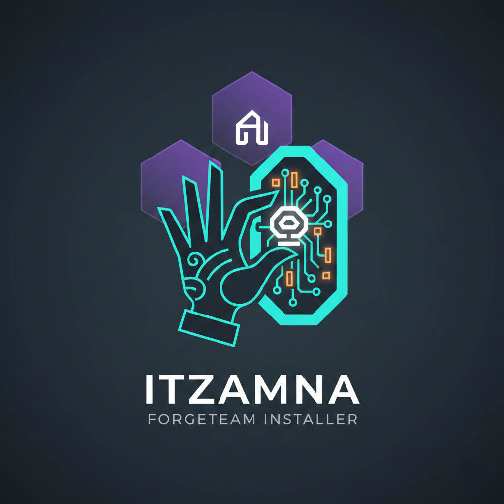

<p align="center">
  
</p>

<h1 align="center">ForgeTeam</h1>

<p align="center">
  <strong>Multi-agent AI orchestrator for Claude Code</strong><br>
  Zero dependencies. Persistent project memory. Dev+Test loops that actually work.
</p>

<p align="center">
  <em>Named after Itzamna, the Mayan god of creation, writing, and knowledge</em>
</p>

---

ForgeTeam turns Claude Code into a team. Instead of one AI doing everything, you get specialized agents — Developer, Tester, Planner, Evaluator, Security Reviewer — that collaborate on your codebase through a shared database. Give it a goal like "Add user authentication" and walk away. It plans the work, writes the code, tests it, evaluates the results, and loops until it's done.

## Why ForgeTeam?

**You're a solo dev or small team using Claude Code.** You've got 5 projects, 30 tasks, and not enough hours. ForgeTeam fixes that:

- **Persistent memory across sessions.** Decisions, task history, session notes, open questions — all stored in SQLite via MCP. No more re-explaining your project every conversation.
- **Dev+Test loops.** Developer writes code. Tester validates. If tests fail, Developer gets the failures and tries again. Up to 3 cycles, automatically. The orchestrator handles DB status updates — agents never run out of turns before housekeeping.
- **Parallel task execution.** Run multiple tasks concurrently with `--tasks 109-114`. Independent tasks execute in parallel (up to 4 by default), cutting batch times by 3-4x.
- **Goal-driven autonomy.** Say "Add dark mode" and the Planner breaks it into tasks, Dev+Test executes each one, the Evaluator reviews results and creates follow-ups. Multiple rounds until the goal is complete.
- **Auto-dispatch across all projects.** One command scans every project, prioritizes by task urgency, and runs up to 16 parallel agents. Leave it running overnight.
- **Auto security reviews.** After every successful dev-test loop, an optional Security Reviewer agent audits the code using ClaudeStick tools and checks for zero-day vulnerabilities.
- **Auto dependency install.** Detects `pyproject.toml` or `package.json` and installs dependencies before the first agent spawns. No more wasting turns on `pip install`.
- **Per-role turn limits.** Developers get 50 turns, Testers get 20, Security Reviewers get 40. Configurable in `dispatch_config.json`. Agents use their budget where it matters.
- **Checkpoint/Resume.** When an agent times out or hits its turn limit, ForgeTeam saves its progress. Next run of that task automatically picks up where it left off — no wasted work.
- **Adaptive complexity.** Tag tasks as `simple`, `medium`, `complex`, or `epic` and ForgeTeam adjusts turn limits automatically (0.5x to 2x). No tag? It infers complexity from the task description.
- **Model tiering.** Use Haiku for testers, Sonnet for developers, Opus for epic tasks. Per-role and per-complexity model overrides in one config file.
- **Self-improving agents (ForgeSmith).** A nightly self-learning system that analyzes agent performance, extracts lessons from failures, auto-tunes turn limits, and patches agent prompts with targeted advice. Agents get smarter every day without manual intervention.
- **Reflexion system.** After every task, agents reflect on what worked, what didn't, and what they'd do differently. These reflections are stored as episodes and injected into future similar tasks — giving agents "experience" to draw on.
- **Rubric-based scoring.** Every agent run is scored against role-specific rubrics (code quality, test coverage, turn efficiency). ForgeSmith uses these scores to evolve rubric weights over time.
- **Zero dependencies.** Pure Python stdlib. No pip, no npm, no Docker. Just Python + Claude Code + a SQLite database.
- **Security by default.** Prompt injection defenses, safe git staging (`git add -u`), and strict MCP config isolation. Agents use the orchestrator's MCP config only.

## Quick Start

### Prerequisites

| Tool | Install |
|------|---------|
| Python 3.10+ | [python.org](https://www.python.org/downloads/) |
| Claude Code CLI | `npm install -g @anthropic-ai/claude-code` |
| git | [git-scm.com](https://git-scm.com/) |
| uvx / uv | [docs.astral.sh/uv](https://docs.astral.sh/uv/) |

You also need a **Claude Pro/Max subscription** or **Anthropic API key**.

### Install (5 minutes)

```bash
git clone https://github.com/[owner]/Itzamna.git
cd Itzamna
python itzamna_setup.py
```

The setup wizard:
1. Checks prerequisites
2. Asks where to install ForgeTeam
3. Creates a fresh SQLite database (28 tables, 7 views)
4. Copies the orchestrator, ForgeSmith, agent prompts, and security skills
5. Generates all config files (`forge_config.json`, `mcp_config.json`, `.mcp.json`, `CLAUDE.md`)
6. Sets up ForgeSmith nightly cron job for self-improvement
7. Verifies everything works (10 automated checks)

### Your first run

```bash
cd ~/ForgeTeam   # wherever you installed

# Register a project
python forge_orchestrator.py --add-project "MyApp" --project-dir "/path/to/myapp"

# Create a task (use Claude with MCP, or direct SQL)
# Then run Dev+Test
python forge_orchestrator.py --task 1 --dev-test -y
```

That's it. The Developer agent writes code, the Tester validates, and they loop until tests pass.

## Modes of Operation

### 1. Single Agent
Run one agent on one task.
```bash
python forge_orchestrator.py --task 42 -y
python forge_orchestrator.py --task 42 --role tester -y
python forge_orchestrator.py --task 42 --role security-reviewer -y
```

### 2. Dev+Test Loop
Developer writes, Tester validates, loop until green.
```bash
python forge_orchestrator.py --task 42 --dev-test -y
```

### 3. Parallel Tasks
Run multiple independent tasks concurrently within a project.
```bash
# Comma-separated IDs
python forge_orchestrator.py --tasks 109,110,111 --dev-test -y

# Range syntax
python forge_orchestrator.py --tasks 109-114 --dev-test -y

# Preview first
python forge_orchestrator.py --tasks 109-114 --dev-test --dry-run
```

### 4. Manager Mode (Goal-Driven)
Give a goal. Planner creates tasks. Dev+Test executes. Evaluator reviews. Repeat.
```bash
python forge_orchestrator.py --goal "Add user authentication" --goal-project 1 -y
```

### 5. Parallel Goals
Run multiple goals across different projects concurrently.
```bash
python forge_orchestrator.py --parallel-goals goals.json -y
```

### 6. Auto-Run
Scan all projects, prioritize, and dispatch agents automatically.
```bash
# Preview what would run
python forge_orchestrator.py --auto-run --dry-run

# Run it
python forge_orchestrator.py --auto-run -y
```

## Architecture

```
                    +-----------------+
                    |  forge_config   |  Your projects, paths, settings
                    +--------+--------+
                             |
                    +--------v--------+
                    |  Orchestrator   |  forge_orchestrator.py
                    |  (pure Python)  |  Reads tasks, spawns agents, manages loops
                    +--------+--------+
                             |
              +--------------+--------------+
              |              |              |
     +--------v---+  +------v------+  +----v-------+
     |  Developer  |  |   Tester    |  |  Planner   |  ...agents
     |  (claude)   |  |  (claude)   |  |  (claude)  |
     +--------+----+  +------+------+  +----+-------+
              |              |              |
              +--------------+--------------+
                             |
                    +--------v--------+
                    |   TheForge DB   |  SQLite via MCP
                    |  (28 tables)    |  Tasks, decisions, sessions, episodes...
                    +--------+--------+
                             |
                    +--------v--------+
                    |   ForgeSmith    |  forgesmith.py (nightly cron)
                    |  Self-learning  |  Lessons, rubrics, prompt patches
                    +-----------------+
```

**How agents communicate:** Every agent gets MCP access to the same SQLite database. The Developer logs decisions and records session notes. The Tester reads the codebase and reports failures. The Planner creates tasks. The Evaluator reviews results. All through the shared database — no custom protocols, no message queues.

**Orchestrator-managed status:** Task status (done/blocked) is updated by the orchestrator based on dev-test outcomes, not by the agents themselves. This eliminates the most common failure mode — agents running out of turns before updating the database.

## Agent Roles

| Role | Job | Can Edit Files | Can Run Builds | DB Access |
|------|-----|:-:|:-:|:-:|
| **Developer** | Write code, fix bugs, implement features | Yes | Yes | Read + Write |
| **Tester** | Run unit tests, report failures | No | Test runners only | Read only |
| **Planner** | Break goals into 2-8 ordered tasks | No | Explore only | Read + Write (tasks) |
| **Evaluator** | Verify goal completion, create follow-ups | No | Explore only | Read + Write (tasks) |
| **Security Reviewer** | 4-phase code security audit | No | Scanning tools only | Read only |
| **Frontend Designer** | Create polished, production-grade UI/UX | Yes | Dev servers | Read + Write |
| **Integration Tester** | Deploy, start, and test full applications end-to-end | No | Full stack | Read only |
| **Debugger** | Trace errors to root cause, fix them, verify | Yes | Yes | Read + Write |
| **Code Reviewer** | Review code quality, consistency, correctness | No | Linters only | Read only |
| **Custom** | Drop a `.md` in `prompts/` — auto-discovered | Configurable | Configurable | Configurable |

## Security Model

ForgeTeam takes a defense-in-depth approach:

- **`--permission-mode bypassPermissions`** — agents run in a controlled sandbox with orchestrator-managed tool access
- **Prompt injection defense** — database content is sanitized before injection into prompts (XML tag escaping, injection pattern filtering)
- **Safe git staging** — `git add -u` instead of `git add .` to prevent accidental secret exposure
- **Strict MCP config** — agents use the orchestrator's MCP config only, ignoring project-level overrides
- **Orchestrator-managed status** — agents can't mark their own tasks done; the orchestrator decides based on test outcomes

## Cost Tracking

Every agent run is logged to the `agent_runs` table with model, duration, turns, and estimated cost:

```sql
-- Cost per project
SELECT * FROM v_cost_by_project;

-- Cost per role
SELECT * FROM v_cost_by_role;
```

## Database

ForgeTeam's persistent memory lives in a SQLite database with 28 tables:

| Group | Tables |
|-------|--------|
| **Core** | projects, tasks, decisions, open_questions, session_notes |
| **Content** | social_media_posts, posting_schedule, content_tickler, writing_style |
| **Research** | research, competitors, product_opportunities |
| **Assets** | code_artifacts, documents, project_assets, components, build_info |
| **System** | cross_references, reminders, agent_runs, voice_messages, api_keys |
| **ForgeSmith** | lessons_learned, agent_episodes, forgesmith_runs, forgesmith_changes, rubric_scores, rubric_evolution_history |

Plus 7 views for dashboards, stale task alerts, content alerts, and cost reports.

Agents access the database through [MCP](https://modelcontextprotocol.io/) (Model Context Protocol) via `mcp-server-sqlite`. No custom database code — just standard SQL through a standard protocol.

## Configuration

| File | Purpose | Generated by setup? |
|------|---------|:---:|
| `forge_config.json` | Project paths, DB path, GitHub owner | Yes |
| `mcp_config.json` | MCP server config for agents | Yes |
| `.mcp.json` | MCP config for your own Claude sessions | Yes |
| `dispatch_config.json` | Auto-run settings (concurrency, model, per-role turns) | Included |
| `forgesmith_config.json` | ForgeSmith self-improvement settings | Included |
| `CLAUDE.md` | Full context for Claude Code | Yes |

### dispatch_config.json

```json
{
    "max_concurrent": 4,
    "model": "sonnet",
    "max_turns": 25,
    "max_turns_developer": 50,
    "max_turns_tester": 20,
    "max_turns_security_reviewer": 40,
    "max_tasks_per_project": 5,
    "security_review": true,
    "model_tester": "haiku",
    "model_epic": "opus"
}
```

**Per-role turn limits** let you give developers more room for complex tasks while keeping testers lean. The `security_review` flag automatically runs a security audit after every successful dev-test loop.

**Model tiering** lets you assign different models per role or per task complexity. Keys follow the pattern `model_{role}` or `model_{complexity}`:

| Key | Effect |
|-----|--------|
| `model_developer` | Model for Developer agents |
| `model_tester` | Model for Tester agents (default: `haiku`) |
| `model_security_reviewer` | Model for Security Review agents |
| `model_simple` | Model for simple-complexity tasks |
| `model_complex` | Model for complex-complexity tasks |
| `model_epic` | Model for epic-complexity tasks (default: `opus`) |

Priority: complexity model > role model > CLI `--model` > global `model`.

## Checkpoint/Resume

When an agent times out or hits its turn limit, ForgeTeam saves its output to `.forge-checkpoints/`. The next time you run that task, the orchestrator automatically loads the checkpoint and tells the agent to continue where the previous attempt left off.

```
  [Checkpoint] Loaded checkpoint from attempt #1 (4200 chars). Agent will continue from there.
```

This eliminates the biggest source of wasted work — complex tasks that need more than one agent session to complete. Checkpoints are automatically cleared when a task succeeds.

## Adaptive Complexity

Tasks can have a `complexity` level that adjusts turn limits and model selection:

| Complexity | Turn Multiplier | Example |
|:----------:|:---------------:|---------|
| `simple` | 0.5x | Fix a typo, update a config |
| `medium` | 1.0x | Add a new endpoint, write tests |
| `complex` | 1.5x | Refactor auth system, add WebSocket support |
| `epic` | 2.0x | Build an ML pipeline, full-stack feature |

Set complexity explicitly in the database:
```sql
UPDATE tasks SET complexity = 'epic' WHERE id = 42;
```

Or leave it unset — ForgeTeam infers complexity from the task description length. A developer with a base of 50 turns working on an `epic` task gets 100 turns. A tester with a base of 20 turns on a `simple` task gets 10.

## ForgeSmith — Self-Improving Agents

ForgeSmith is ForgeTeam's self-learning system. It runs nightly (via cron) and makes your agents better automatically.

### What It Does

1. **Lesson extraction** — Analyzes failed agent runs, identifies recurring errors, and distills actionable lessons. These lessons are injected into future agent prompts so the same mistakes aren't repeated.

2. **Agent episodes** — After every task, agents write a reflection (what worked, what didn't, what they'd do differently). ForgeSmith stores these as episodes with Q-values. When a similar task comes up, the best episodes are injected as "past experience."

3. **Prompt patching** — ForgeSmith can append targeted advice to agent prompt files (e.g., "Turn Budget Management" and "Time Management" sections in `developer.md`). Changes are backed up and can be reverted if performance drops.

4. **Turn limit tuning** — If agents consistently hit their max turns, ForgeSmith increases the limit. If they consistently finish early, it decreases. Changes are logged in `forgesmith_changes`.

5. **Rubric scoring** — Every agent run is scored against role-specific criteria (e.g., developers are scored on result success, files changed, tests written, turn efficiency). Rubric weights evolve over time based on correlation with success.

### Running ForgeSmith

```bash
# Automatic (set up by installer as midnight cron)
python forgesmith.py --auto

# Dry run — see what it would change
python forgesmith.py --dry-run

# Manual run with verbose output
python forgesmith.py --auto --verbose
```

### Configuration

`forgesmith_config.json` controls all ForgeSmith behavior:
- `lookback_days` — How many days of history to analyze (default: 7)
- `min_sample_size` — Minimum runs before making changes (default: 5)
- `rubric_definitions` — Per-role scoring criteria and weights
- `protected_files` — Files ForgeSmith will never modify
- `rollback_threshold` — Performance drop that triggers automatic rollback

## Documentation

| Doc | Description |
|-----|-------------|
| [Quick Start](docs/QUICKSTART.md) | 5-minute getting started guide |
| [User Guide](docs/USER_GUIDE.md) | Full reference — all CLI modes, config, troubleshooting |
| [Custom Agents](docs/CUSTOM_AGENTS.md) | Create new agent roles with a markdown file |
| [Concurrency](docs/CONCURRENCY.md) | Benchmark results (16 parallel agents) and tuning |

## Concurrency

ForgeTeam was benchmarked at 16 concurrent multi-turn agents with zero throttling on Claude Max. The local machine is the bottleneck, not the API:

| Machine | Recommended `max_concurrent` |
|---------|:---:|
| 8 GB RAM | 2-3 |
| 16 GB RAM | 4-6 |
| 32 GB RAM | 8-12 |
| 64 GB+ RAM | 12-16 |

See [CONCURRENCY.md](docs/CONCURRENCY.md) for full benchmark data.

## Contributing

Contributions welcome. ForgeTeam is built for the vibe coding community — if you're using Claude Code to build software, this is for you.

1. Fork the repo
2. Create a branch (`git checkout -b feature/my-feature`)
3. Make your changes
4. Test with `--dry-run` to verify prompt generation
5. Submit a PR

## License

[Apache License 2.0](LICENSE) — use it commercially, modify it, distribute it. Just include the license and attribution.

---

<p align="center">
  Built by <a href="https://github.com/[owner]">Forgeborn</a> — vibe coded with Claude
</p>
