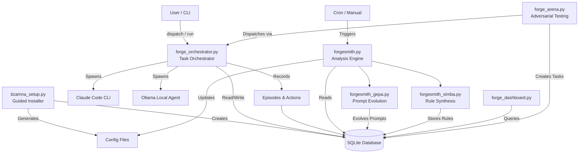
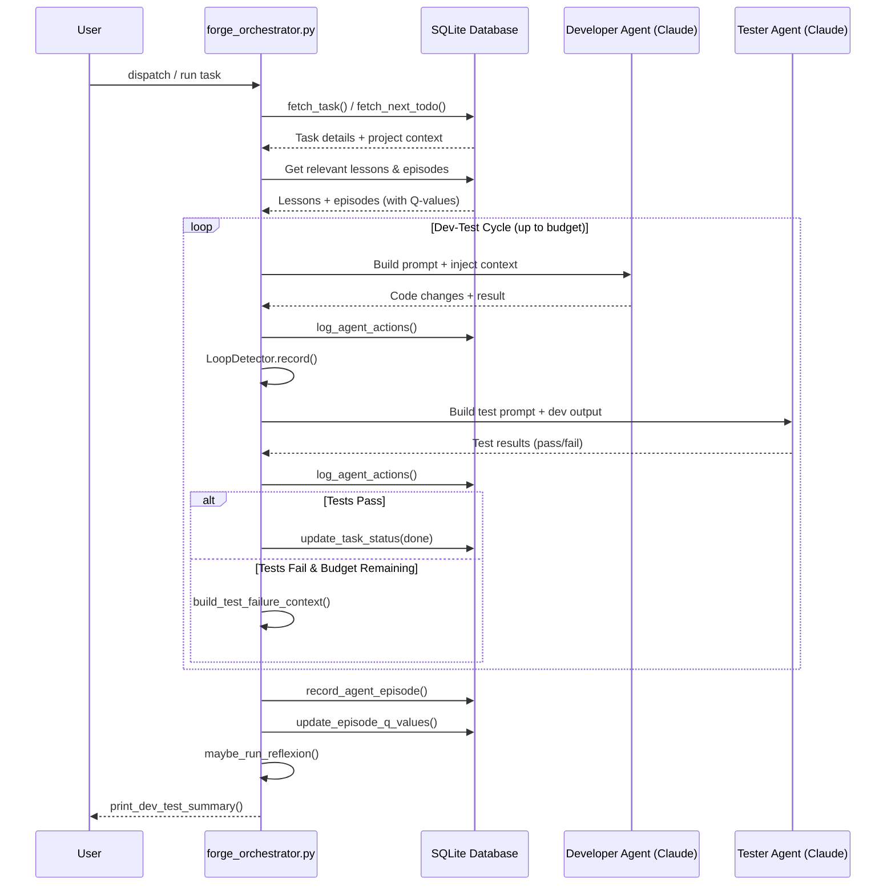
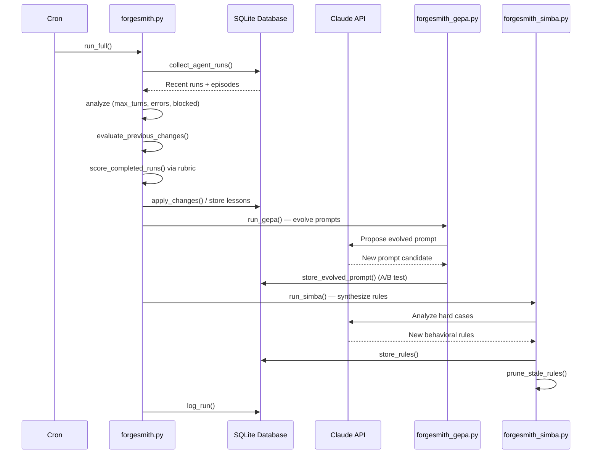
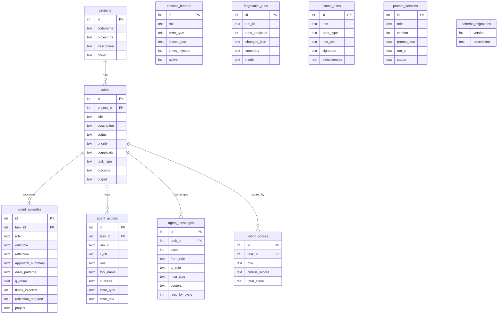

# ARCHITECTURE.md — Itzamna (ForgeTeam)

## Table of Contents

- [ARCHITECTURE.md — Itzamna (ForgeTeam)](#architecturemd-itzamna-forgeteam)
  - [How It Works](#how-it-works)
  - [System Overview](#system-overview)
  - [Data Flow](#data-flow)
    - [Typical Task Execution (Dev-Test Loop)](#typical-task-execution-dev-test-loop)
    - [ForgeSmith Self-Improvement Cycle](#forgesmith-self-improvement-cycle)
  - [Database](#database)
  - [Project Structure](#project-structure)
  - [Key Design Decisions](#key-design-decisions)
    - [SQLite as the sole data store](#sqlite-as-the-sole-data-store)
    - [Dev-Test Loop with dynamic budgets](#dev-test-loop-with-dynamic-budgets)
    - [LoopDetector with fingerprinting](#loopdetector-with-fingerprinting)
    - [Episodic memory with Q-values](#episodic-memory-with-q-values)
    - [Three-tier self-improvement (ForgeSmith → GEPA → SIMBA)](#three-tier-self-improvement-forgesmith-gepa-simba)
    - [Provider abstraction (Claude + Ollama)](#provider-abstraction-claude-ollama)
    - [Checkpoint-based resilience](#checkpoint-based-resilience)
    - [Inter-agent messaging](#inter-agent-messaging)
    - [Schema migrations with versioning](#schema-migrations-with-versioning)
  - [Related Documentation](#related-documentation)

## How It Works

ForgeTeam is a multi-agent AI orchestration platform that coordinates AI agents (powered by Claude Code and optionally Ollama) to work on software development tasks. Here's how it works in plain English:

**When you set up ForgeTeam**, you run `itzamna_setup.py`, which walks you through a guided installation: checking prerequisites, choosing an install path, creating a SQLite database with all required tables, and generating configuration files. This is the "Itzamna" installer — the front door to the whole system.

**When you dispatch work**, the `forge_orchestrator.py` scans your database for pending tasks, scores and prioritizes them, then dispatches them to specialized AI agent roles. The orchestrator runs a **dev-test loop**: a Developer agent writes code, then a Tester agent validates it, cycling back and forth until the task passes or the turn budget is exhausted. There's also a Security Reviewer role that can audit code. Each role gets a tailored system prompt, relevant lessons from past experiences, and episodic memory injected into its context.

**When agents run**, they execute via Claude Code CLI (or Ollama for local models). The orchestrator captures their output, parses results, classifies errors, detects stuck loops (via `LoopDetector`), and manages checkpoints so work can resume if interrupted. Agents communicate through an inter-agent messaging system stored in the database.

**When tasks complete**, the orchestrator records "episodes" — structured memories of what happened, what worked, and what failed. These episodes get Q-values (reinforcement learning scores) that update based on whether similar approaches succeed or fail in the future. The system literally learns from experience.

**When ForgeSmith runs** (typically via cron), it analyzes recent agent performance and evolves the system. It has three engines:
- **Core ForgeSmith** (`forgesmith.py`): Analyzes runs, extracts lessons, detects patterns (repeated errors, turn overuse/underuse, model mismatches), proposes config/prompt changes, and evaluates whether previous changes helped.
- **GEPA** (`forgesmith_gepa.py`): Genetic/Evolutionary Prompt Adaptation — uses DSPy-style optimization to evolve agent system prompts, with A/B testing and rollback.
- **SIMBA** (`forgesmith_simba.py`): Synthesizes Intelligent Meta-Behavioral Advice — analyzes high-variance and hard cases to generate new operational rules for agents.

**When you check the dashboard**, `forge_dashboard.py` queries the database and checkpoint files to show task completion rates, project progress, blocked tasks, and session activity.

**The Forge Arena** (`forge_arena.py`) is a structured adversarial testing system that creates challenge tasks across multiple phases to stress-test and improve agent capabilities, exporting results as LoRA fine-tuning data.

## System Overview



## Data Flow

### Typical Task Execution (Dev-Test Loop)



### ForgeSmith Self-Improvement Cycle



## Database



## Project Structure

```
.
├── forge_orchestrator.py         # Core orchestrator — task dispatch, dev-test loops, agent management
├── forgesmith.py                 # Self-improvement engine — analyzes runs, extracts lessons, proposes changes
├── forgesmith_gepa.py            # Genetic/Evolutionary Prompt Adaptation — evolves system prompts with A/B testing
├── forgesmith_simba.py           # Rule synthesis — generates behavioral rules from hard cases
├── forgesmith_backfill.py        # Backfills episode data from historical logs
├── forge_dashboard.py            # Terminal dashboard — task stats, project completion, activity
├── forge_arena.py                # Adversarial testing arena — stress-tests agents, exports LoRA data
├── itzamna_setup.py              # Guided installer — prerequisites, DB setup, config generation
├── db_migrate.py                 # Database schema migrations (v0→v1→v2→v3)
├── analyze_performance.py        # Performance reporting — completion rates, throughput, checkpoint analysis
├── ollama_agent.py               # Local Ollama agent — sandboxed tool execution, file operations
├── prepare_training_data.py      # Converts datasets into chat-format training data for fine-tuning
├── train_qlora.py                # QLoRA fine-tuning script (manual implementation)
├── train_qlora_peft.py           # QLoRA fine-tuning script (PEFT/Hugging Face)
├── skills/
│   └── security/
│       └── static-analysis/
│           └── skills/sarif-parsing/
│               └── resources/
│                   └── sarif_helpers.py   # SARIF security report parsing and analysis utilities
├── tests/
│   ├── test_agent_actions.py             # Tests for action logging and error classification
│   ├── test_agent_messages.py            # Tests for inter-agent messaging system
│   ├── test_early_termination.py         # Tests for stuck detection and loop termination
│   ├── test_loop_detection.py            # Tests for LoopDetector fingerprinting and thresholds
│   ├── test_episode_injection.py         # Tests for episodic memory retrieval and Q-value updates
│   ├── test_lessons_injection.py         # Tests for lesson retrieval and prompt injection
│   ├── test_forgesmith_simba.py          # Tests for SIMBA rule synthesis pipeline
│   ├── test_rubric_scoring.py            # Tests for rubric scoring and evolution
│   ├── test_task_type_routing.py         # Tests for task_type-based prompt dispatch
│   └── test_task_665_verification.py     # Integration verification tests
└── CLAUDE.md                             # Project context document for AI agents
```

## Key Design Decisions

### SQLite as the sole data store
Everything — tasks, episodes, lessons, messages, rules, prompt versions, migration history — lives in a single SQLite database. This is intentional: zero pip dependencies (stdlib only), trivially portable, and easy to back up. The system is designed for single-machine orchestration, not distributed deployment.

### Dev-Test Loop with dynamic budgets
Rather than running one agent and hoping for the best, the orchestrator cycles between Developer and Tester agents. The turn budget is dynamic — `calculate_dynamic_budget()` and `adjust_dynamic_budget()` adapt based on task complexity and intermediate results. This prevents both premature termination and runaway loops.

### LoopDetector with fingerprinting
Agents can get stuck repeating the same failing approach. `LoopDetector` creates deterministic fingerprints of agent outputs (result, blockers, errors) and tracks consecutive identical fingerprints. It issues warnings at a threshold and forces termination at a higher one. File changes reset the counter — the agent is actually making progress.

### Episodic memory with Q-values
Agent episodes aren't just logs — they're learning signals. Each episode gets a Q-value that starts from the outcome (`compute_initial_q_value`) and gets updated when similar episodes are injected into future tasks (`update_episode_q_values`). High-Q episodes get preferentially injected, creating a reinforcement learning loop without explicit training.

### Three-tier self-improvement (ForgeSmith → GEPA → SIMBA)
Self-improvement is layered. Core ForgeSmith does rule-based analysis (repeated errors → lessons, turn overuse → config changes). GEPA uses evolutionary optimization to rewrite entire system prompts with A/B testing and rollback safety. SIMBA targets the hardest cases — high-variance and low-success episodes — to synthesize specific behavioral rules. Each tier operates at a different granularity and timescale.

### Provider abstraction (Claude + Ollama)
The orchestrator supports both Claude Code (via CLI) and local Ollama models. `get_provider()`, `get_ollama_model()`, and `get_role_model()` resolve which backend to use per role, allowing cost-sensitive routing (e.g., use local models for simple tasks, Claude for complex ones).

### Checkpoint-based resilience
Long-running agent tasks save checkpoints (`save_checkpoint`/`load_checkpoint`). If a task is interrupted, the next run loads the checkpoint and builds context from it rather than starting from scratch. This is critical for multi-cycle dev-test loops that can take many minutes.

### Inter-agent messaging
Agents don't just pass results through the orchestrator — they can leave structured messages for each other via `post_agent_message` / `read_agent_messages`. Messages are scoped by task and cycle, with read-tracking so agents don't process the same message twice. This enables richer coordination than simple output passing.

### Schema migrations with versioning
`db_migrate.py` implements a linear migration chain (v0→v1→v2→v3) with automatic backup before migration, legacy version detection, and a `schema_migrations` audit log. This lets the database evolve safely as new features are added.
---

## Related Documentation

- [Readme](README.md)
- [Api](API.md)
- [Deployment](DEPLOYMENT.md)
- [Contributing](CONTRIBUTING.md)
