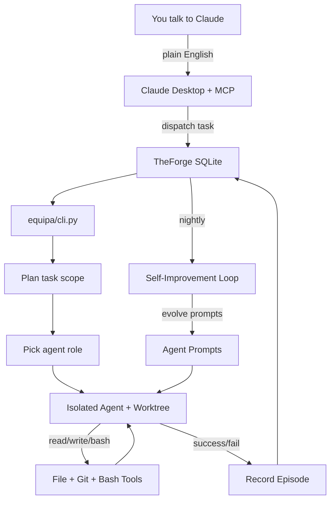
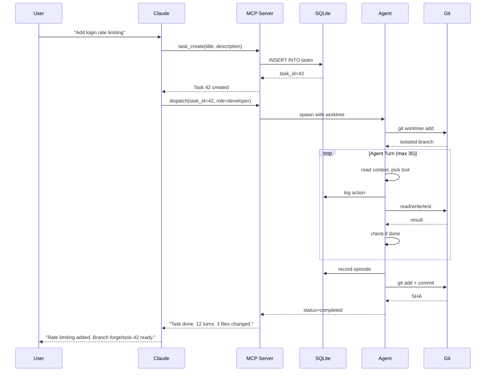

# ARCHITECTURE.md

## Table of Contents

- [ARCHITECTURE.md](#architecturemd)
  - [How It Works](#how-it-works)
  - [System Overview](#system-overview)
  - [Data Flow](#data-flow)
  - [Database](#database)
  - [Project Structure](#project-structure)
  - [Key Design Decisions](#key-design-decisions)
  - [Current Limitations](#current-limitations)
  - [Related Documentation](#related-documentation)

## How It Works

You open Claude Desktop. You say "fix the login bug" or "add dark mode to the settings page". Claude creates a task in TheForge (EQUIPA's SQLite database), picks the right agent role, and dispatches it.

Behind the scenes, EQUIPA spins up a specialized agent — maybe Developer for writing code, or Tester for running your test suite. The agent works in an isolated git worktree so it can't trash your main branch. It reads files, writes code, runs tests, commits changes. If tests fail, Developer hands off to Tester. If there are security issues, SecurityReviewer steps in.

Each agent turn is one API call to Claude. The agent sees the task description, relevant code context, and tools (read_file, bash, edit_file, etc). It picks a tool, executes it, sees the result, picks another tool. This loops until the task succeeds, the agent runs out of turns (default 35), or it gets stuck.

When an agent finishes, EQUIPA saves an "episode" — what worked, what failed, how many turns it took, what files changed. ForgeSmith (the self-improvement engine) reads these episodes every night, spots patterns in failures, and evolves agent prompts or config settings to fix recurring problems.

If an agent fails, EQUIPA auto-retries up to 3 times. Each retry gets a fresh git worktree. After 3 failures, the task goes to "blocked" status and you get a summary of what went wrong.

You never touch the CLI. You just talk to Claude. Claude reads task status, checks logs, and reports back. "The feature is done, tests pass, branch is ready for review."

---

## System Overview



**Key insight:** Most users never run `python -m equipa`. They just talk to Claude, who uses the MCP server (`equipa/mcp_server.py`) to create/dispatch/monitor tasks. The CLI exists for scripting and automation, but the primary interface is conversational.

---

## Data Flow



---

## Database

```mermaid
erDiagram
    tasks ||--o{ agent_runs : has
    tasks ||--o{ session_notes : references
    tasks {
        int id PK
        string title
        text description
        string status
        string priority
        int project_id FK
        timestamp created_at
    }
    
    agent_runs ||--o{ agent_episodes : generates
    agent_runs {
        int id PK
        int task_id FK
        string role
        int turns_used
        string outcome
        float cost_estimate
        timestamp started_at
    }
    
    agent_episodes ||--o{ lessons : teaches
    agent_episodes {
        int id PK
        int run_id FK
        string role
        text reflection
        text approach_summary
        float q_value
        text embedding JSON
    }
    
    lessons {
        int id PK
        string role
        string error_type
        text content
        int times_injected
        bool is_active
    }
    
    forgesmith_changes ||--o{ tasks : impacts
    forgesmith_changes {
        int id PK
        string change_type
        text rationale
        bool is_active
        timestamp created_at
    }
    
    simba_rules ||--o{ agent_runs : guides
    simba_rules {
        int id PK
        string role
        string error_type
        text rule_text
        float effectiveness
    }
    
    knowledge_graph ||--o{ lessons : connects
    knowledge_graph ||--o{ agent_episodes : connects
    knowledge_graph {
        string from_id PK
        string to_id PK
        string edge_type
        float weight
    }
```

**Note:** This is simplified. The real schema has 30+ tables. See `equipa/schema.sql` for the full DDL.

---

## Project Structure

```
equipa/
├── cli.py              # Main entry point, arg parsing, async orchestration
├── mcp_server.py       # JSON-RPC server for Claude Desktop MCP integration
├── dispatch.py         # Auto-dispatch logic, project scoring, parallel execution
├── agent_runner.py     # Agent loop: API calls, tool execution, turn limits
├── prompts.py          # Load and build agent system prompts with cache split
├── git_ops.py          # Worktree isolation, branch management, merge handling
├── bash_security.py    # Command injection filters (12+ regex checks)
├── monitoring.py       # Loop detection, early termination, budget tracking
├── checkpoints.py      # Soft checkpoint streaming for context compaction recovery
├── db.py               # SQLite connection pooling, schema setup
├── lessons.py          # Episodic memory retrieval, SIMBA rule injection
├── embeddings.py       # Ollama embedding generation, cosine similarity search
├── graph.py            # Knowledge graph PageRank, co-accessed edges, label propagation
├── routing.py          # Cost-based model selection, circuit breaker fallback
├── parsing.py          # Extract reflections, test results, file changes from agent output
├── tasks.py            # Task CRUD, project context fetching
└── schema.sql          # 30+ table DDL with indexes and views

scripts/
├── forgesmith.py       # Nightly self-improvement: analyze episodes, evolve prompts/config
├── forgesmith_gepa.py  # Genetic Episodic Prompt Architecture (DSPy-based prompt evolution)
├── forgesmith_simba.py # SIMBA: Self-Improving Memory-Based Adaptation (rule generation)
└── nightly_review.py   # Daily portfolio health report

tests/
├── test_agent_runner.py          # Agent loop, retry logic, model fallback
├── test_bash_security.py         # 80+ injection patterns blocked
├── test_loop_detection.py        # Stuck agent detection, fingerprint hashing
├── test_early_termination.py     # Monologue detection, cost breaker, preflight checks
├── test_vector_memory.py         # Embedding-based episode retrieval
├── test_knowledge_graph.py       # PageRank, similarity edges, reranking
├── test_cost_routing.py          # Complexity scoring, circuit breaker, model tier selection
└── test_db_migration_*.py        # Schema migration validation (v1-v7)
```

---

## Key Design Decisions

**1. Conversational interface first**  
Most users never touch the CLI. They talk to Claude in plain English. Claude creates tasks, dispatches agents, monitors progress, and reports back. The MCP server (`equipa/mcp_server.py`) is the primary interface. The CLI exists for automation and scripting.

**2. Zero dependencies**  
Pure Python stdlib. No pip installs. No version conflicts. Copy the repo, run `python -m equipa`. Works on any machine with Python 3.10+. This was a hard constraint — makes deployment trivial and keeps the codebase auditable.

**3. Git worktree isolation**  
Every agent gets its own `git worktree` so it can't corrupt your main branch. If it breaks things, the worktree gets nuked. If it succeeds, you merge the branch. This is still being refined — merge conflicts occasionally need manual intervention.

**4. Self-improvement via episodic memory**  
ForgeSmith reads completed agent runs, spots recurring failure patterns, and evolves prompts or config settings to fix them. GEPA (Genetic Episodic Prompt Architecture) uses DSPy to evolve prompts based on success/failure examples. SIMBA (Self-Improving Memory-Based Adaptation) generates tactical rules injected into agent context. This takes 20-30 tasks before you see results — not instant magic.

**5. Anti-compaction state persistence**  
Long tasks hit Claude's context limit and get compacted (old messages dropped). Agents save `.forge-state.json` checkpoints so they can resume from where they left off instead of starting over. Soft checkpoints stream to disk every few turns. If an agent gets killed, the replacement picks up its progress.

**6. Retry with jitter and model fallback**  
API calls use exponential backoff (500ms base, 25% jitter, 32s cap). After 3 `overloaded_error` responses, we fall back from opus to sonnet. After 3 task failures, the task goes to "blocked" and you get a report.

**7. Bash security filter**  
12+ regex checks block command injection, IFS manipulation, process substitution, heredocs, unicode whitespace, and more. Ported from Claude Code's production security layer. See `test_bash_security.py` for 80+ blocked patterns.

**8. Knowledge graph with PageRank**  
Episodes and lessons connect via co-accessed edges (used together in the same task) and similarity edges (high cosine similarity). PageRank scores nodes by centrality. Episodes that help many tasks rank higher and get injected more often. Enabled via `vector_memory: true` in dispatch config.

**9. Cost controls that kill runaway agents**  
Max turns (default 35), cost cap per complexity tier, early termination on monologue (3 consecutive text-only turns with no tool use), stuck phrase detection ("I apologize", "I need to think"). Loop detector kills agents that repeat the same bash command 5 times with the same error.

**10. Cross-platform scheduling**  
ForgeSmith nightly runs are auto-configured during setup. Linux/WSL uses cron, Windows uses Task Scheduler. Setup wizard writes the crontab/XML and validates it runs.

---

## Current Limitations

**Agents still get stuck**  
Complex tasks with vague requirements can trigger analysis paralysis. The agent reads files, thinks out loud, reads more files, never writes code. Early termination helps but doesn't catch every case.

**Git worktree merges need babysitting**  
If your main branch changed a lot since the agent started, `git merge` can fail with conflicts. You have to resolve them manually. We could auto-rebase but that risks silently breaking things.

**Self-improvement needs data**  
ForgeSmith works great after 30+ tasks. On day one with 5 completed tasks, it doesn't have enough signal to spot patterns. Be patient or seed it with synthetic episodes.

**Tester depends on tests existing**  
If your project has no test suite, Tester role is useless. It will try to run `pytest`, `npm test`, or `go test` and report "no tests found". Developer role can write tests but often skips them unless you explicitly ask.

**Test-driven iteration isn't seamless**  
The dev-test loop (Developer writes code, Tester runs tests, Developer fixes failures) works but costs a lot of turns. If tests fail 3 times, the task usually gets stuck. We need better test failure context injection.

**Early termination can kill legitimate work**  
10 turns of reading without writing triggers early termination. Some complex tasks legitimately need that much investigation. Exempting certain roles helps but isn't perfect.

**No incremental commits**  
Agents commit everything at the end. If they fail partway through, you lose all progress. Soft checkpoints save state but don't create git commits. We should commit after every file write that passes basic syntax checks.

**Vector memory depends on Ollama**  
Embedding-based retrieval requires Ollama running locally with `nomic-embed-text` model. If Ollama is down, it falls back to keyword matching. Should support OpenAI embeddings API as an alternative.

**Prompt cache split is fragile**  
We split prompts into static (common) and dynamic (task-specific) parts to maximize Claude's prompt caching. If the boundary marker (`<!-- TASK_CONTEXT -->`) gets corrupted, caching breaks and costs spike. Should validate boundary integrity before sending.

**Knowledge graph is opt-in and slow**  
PageRank reranking helps episode retrieval but adds latency. Disabled by default. Needs better benchmarking on large datasets (1000+ episodes).
---

## Related Documentation

- [Readme](README.md)
- [Api](API.md)
- [Deployment](DEPLOYMENT.md)
- [Contributing](CONTRIBUTING.md)
