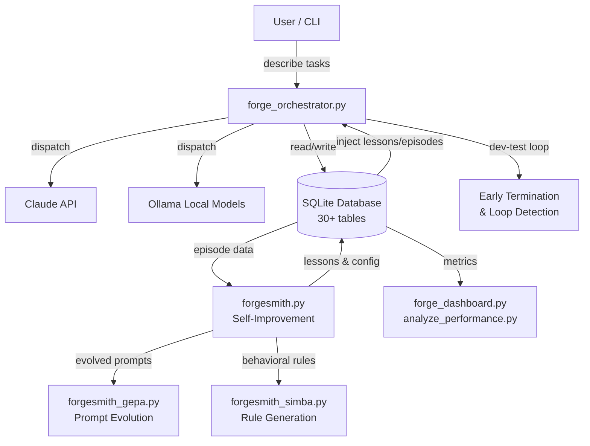
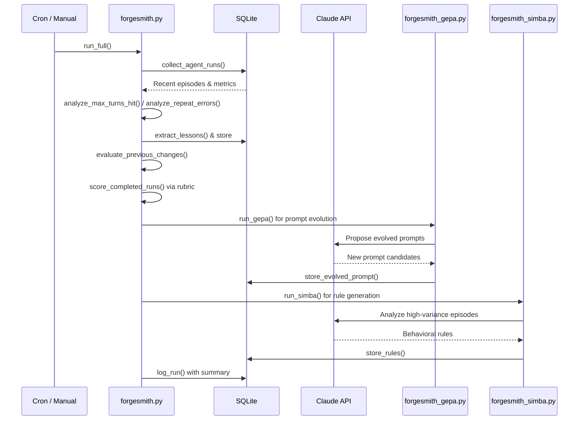
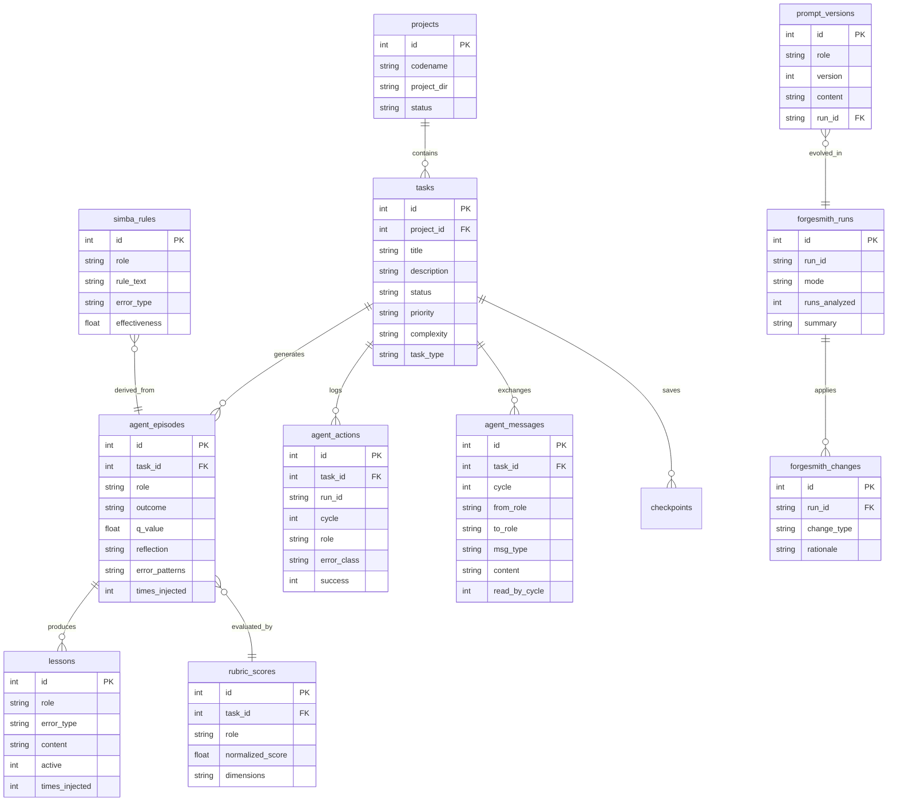

# ARCHITECTURE.md — EQUIPA

## Table of Contents

- [ARCHITECTURE.md — EQUIPA](#architecturemd-equipa)
  - [How It Works](#how-it-works)
  - [System Overview](#system-overview)
  - [Data Flow](#data-flow)
    - [Typical Task Execution](#typical-task-execution)
    - [Self-Improvement Cycle (Forgesmith)](#self-improvement-cycle-forgesmith)
  - [Database](#database)
  - [Project Structure](#project-structure)
  - [Key Design Decisions](#key-design-decisions)
    - [Pure Python stdlib, zero pip dependencies](#pure-python-stdlib-zero-pip-dependencies)
    - [SQLite as the single source of truth](#sqlite-as-the-single-source-of-truth)
    - [Closed-loop self-improvement](#closed-loop-self-improvement)
    - [Aggressive early termination](#aggressive-early-termination)
    - [Lesson sanitization as a security boundary](#lesson-sanitization-as-a-security-boundary)
    - [Dev-test loop as the core execution pattern](#dev-test-loop-as-the-core-execution-pattern)
    - [Multi-tier model routing](#multi-tier-model-routing)
    - [Prompt evolution with safety rails](#prompt-evolution-with-safety-rails)
  - [Related Documentation](#related-documentation)

## How It Works

EQUIPA is a multi-agent AI orchestration platform where you describe what you want built in plain English, and a fleet of AI agents (developer, tester, security reviewer, planner) execute the work autonomously. Here's how it works in practice:

**When you give EQUIPA a task**, the `forge_orchestrator.py` scans a SQLite database for pending work, figures out which agent role should handle it (developer, tester, security reviewer), builds a detailed prompt with relevant context (project info, past lessons learned, prior episode outcomes), and dispatches the task to Claude (or optionally a local Ollama model). The developer agent writes code, the tester agent validates it, and they iterate in a dev-test loop until the task passes or budget/turn limits are hit.

**While agents run**, the orchestrator tracks everything: it detects stuck loops (agents repeating the same failed action), monologue behavior (agents talking instead of using tools), cost overruns, and alternating error patterns. If an agent gets stuck, the system warns it, and if it doesn't recover, terminates early. Every action, error, and outcome is logged to SQLite as "episodes" — structured records of what happened, what worked, and what didn't.

**After tasks complete**, the system learns from its own history. `forgesmith.py` is the self-improvement engine: it analyzes agent runs, extracts lessons from failures, adjusts configuration (max turns, model selection), and evolves prompts. `forgesmith_gepa.py` uses DSPy-style prompt evolution to iteratively improve role-specific prompts. `forgesmith_simba.py` generates behavioral rules from high-variance episodes. These learned lessons and rules get injected back into future agent prompts, creating a feedback loop.

**The dashboard and analysis tools** (`forge_dashboard.py`, `analyze_performance.py`, `nightly_review.py`) query the database to show task completion rates, blocked work, agent performance metrics, and portfolio health — giving you visibility into what the system is doing and how well it's performing.

---

## System Overview



---

## Data Flow

### Typical Task Execution

```mermaid
sequenceDiagram
    participant User
    participant Orch as forge_orchestrator
    participant DB as SQLite
    participant Agent as Claude / Ollama
    participant Loop as Loop Detector

    User->>Orch: Submit task (CLI args or dispatch)
    Orch->>DB: fetch_task() / scan_pending_work()
    DB-->>Orch: Task details + project context
    Orch->>DB: get_relevant_lessons() + get_relevant_episodes()
    DB-->>Orch: Lessons & episodes for injection
    Orch->>Orch: build_task_prompt() with context
    
    loop Dev-Test Cycle
        Orch->>Agent: Run developer agent
        Agent-->>Orch: Code changes + result
        Orch->>Loop: Check for stuck/monologue/loops
        Loop-->>Orch: ok / warn / terminate
        Orch->>Agent: Run tester agent
        Agent-->>Orch: Test results
        Orch->>Loop: Check test loop status
        Loop-->>Orch: ok / warn / terminate
    end
    
    Orch->>DB: record_agent_episode()
    Orch->>DB: update_task_status()
    Orch->>DB: update_episode_q_values()
    Orch->>DB: bulk_log_agent_actions()
    Orch-->>User: Print summary
```

### Self-Improvement Cycle (Forgesmith)



---

## Database



---

## Project Structure

```
Equipa/
├── forge_orchestrator.py        # Core orchestrator — task dispatch, dev-test loop, episode recording
├── forgesmith.py                # Self-improvement engine — analyzes runs, extracts lessons, tunes config
├── forgesmith_gepa.py           # GEPA prompt evolution — DSPy-style iterative prompt optimization
├── forgesmith_simba.py          # SIMBA rule generation — behavioral rules from high-variance episodes
├── forgesmith_impact.py         # Impact assessment — blast radius analysis for config changes
├── forgesmith_backfill.py       # Backfill tool — retroactively parses logs into structured episodes
├── forge_dashboard.py           # Dashboard — task summaries, checkpoint analysis, project health
├── forge_arena.py               # Arena — automated multi-phase stress testing and LoRA data export
├── ollama_agent.py              # Local model agent — sandboxed tool execution via Ollama
├── lesson_sanitizer.py          # Security — strips injection attacks from lesson content
├── rubric_quality_scorer.py     # Quality scoring — multi-dimensional rubric for agent outputs
├── nightly_review.py            # Nightly report — portfolio stats, blockers, stale projects
├── analyze_performance.py       # Performance analytics — completion rates, throughput, trends
├── autoresearch_prompts.py      # Prompt optimization — OPRO-style prompt research with LLMs
├── autoresearch_loop.py         # Optimization loop — deploy/test/measure/rollback prompt variants
├── db_migrate.py                # Schema migrations — versioned DB upgrades with backup
├── benchmark_migrations.py      # Migration benchmarks — validates migration correctness & speed
├── equipa_setup.py              # Setup wizard — interactive installer for new deployments
├── prepare_training_data.py     # Training data prep — converts episodes to fine-tuning format
├── train_qlora_peft.py          # QLoRA training — fine-tune with PEFT/LoRA
├── train_qlora.py               # QLoRA training — alternative training pipeline
├── ingest_training_results.py   # Training ingestion — imports training metrics back to DB
├── skills/                      # Skill modules
│   └── security/
│       └── static-analysis/
│           └── sarif_helpers.py # SARIF parsing — load, filter, deduplicate security findings
├── tests/
│   ├── test_early_termination.py        # Tests for stuck detection, loop detection, budget tracking
│   ├── test_early_termination_monologue.py  # Tests for monologue detection
│   ├── test_loop_detection.py           # Tests for LoopDetector class
│   ├── test_task_type_routing.py        # Tests for task type dispatch config
│   ├── test_rubric_scoring.py           # Tests for rubric scoring system
│   ├── test_rubric_quality_scorer.py    # Tests for quality scorer dimensions
│   ├── test_lessons_injection.py        # Tests for lesson retrieval and injection
│   ├── test_lesson_sanitizer.py         # Tests for sanitization and security
│   ├── test_episode_injection.py        # Tests for episode retrieval and Q-value updates
│   ├── test_forgesmith_simba.py         # Tests for SIMBA rule generation pipeline
│   ├── test_agent_messages.py           # Tests for inter-agent messaging
│   └── test_agent_actions.py            # Tests for action logging and error classification
└── CLAUDE.md                    # Project context file for Claude
```

---

## Key Design Decisions

### Pure Python stdlib, zero pip dependencies
The core system uses only Python's standard library and SQLite. This eliminates dependency hell, makes deployment trivial (copy files + run setup), and ensures the system works anywhere Python runs. The only external dependencies are the AI providers themselves (Claude API, optionally Ollama).

### SQLite as the single source of truth
Everything lives in one SQLite database with 30+ tables: tasks, episodes, lessons, rules, config changes, rubric scores, prompt versions. This means no Redis, no Postgres, no message queues — just a single file that's easy to back up, inspect with `sqlite3`, and migrate with `db_migrate.py`. The tradeoff is concurrency, but since agent dispatch is controlled by the orchestrator, write contention is managed.

### Closed-loop self-improvement
The system learns from its own failures through three mechanisms: **lessons** (text patterns extracted from failed runs), **episodes with Q-values** (reinforcement-learning-style scoring of past approaches), and **SIMBA rules** (behavioral guidelines generated by Claude from high-variance outcomes). These all feed back into future prompts, creating a system that genuinely improves over time.

### Aggressive early termination
Rather than letting agents burn tokens spinning in circles, the `LoopDetector` tracks fingerprints of agent actions, detects consecutive repetition (same tool + same result), alternating patterns (A-B-A-B oscillation), and monologue behavior (text-only responses without tool use). Warnings come first, then hard termination. Cost breakers scale with task complexity.

### Lesson sanitization as a security boundary
Since lessons generated from past runs get injected into future prompts, `lesson_sanitizer.py` strips XML injection tags, role override phrases, base64 payloads, ANSI escapes, and dangerous code blocks. This prevents a compromised or adversarial output from poisoning the learning pipeline.

### Dev-test loop as the core execution pattern
Most code tasks run through `run_dev_test_loop()`: a developer agent writes code, a tester agent validates it, and they iterate with compacted context from prior cycles. This mirrors how human developers work — write, test, fix — and the cycle count adapts dynamically based on progress signals.

### Multi-tier model routing
The orchestrator routes tasks to different models based on role, complexity, and configuration. Simple tasks might use cheaper/faster models, complex tasks get the most capable model, and the dispatch config can override per-task-type. Ollama provides a local fallback for cost-sensitive or offline scenarios.

### Prompt evolution with safety rails
`forgesmith_gepa.py` evolves prompts using Claude itself, but with guardrails: diff ratio limits, protected section checks, validation of evolved outputs, A/B testing support, and versioned rollback. Changes are logged to the database so every prompt mutation is traceable and reversible.
---

## Related Documentation

- [Readme](README.md)
- [Api](API.md)
- [Deployment](DEPLOYMENT.md)
- [Contributing](CONTRIBUTING.md)
