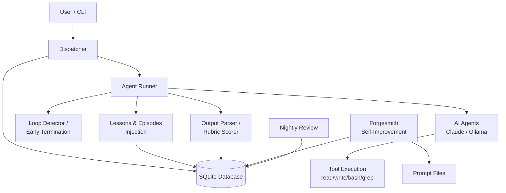
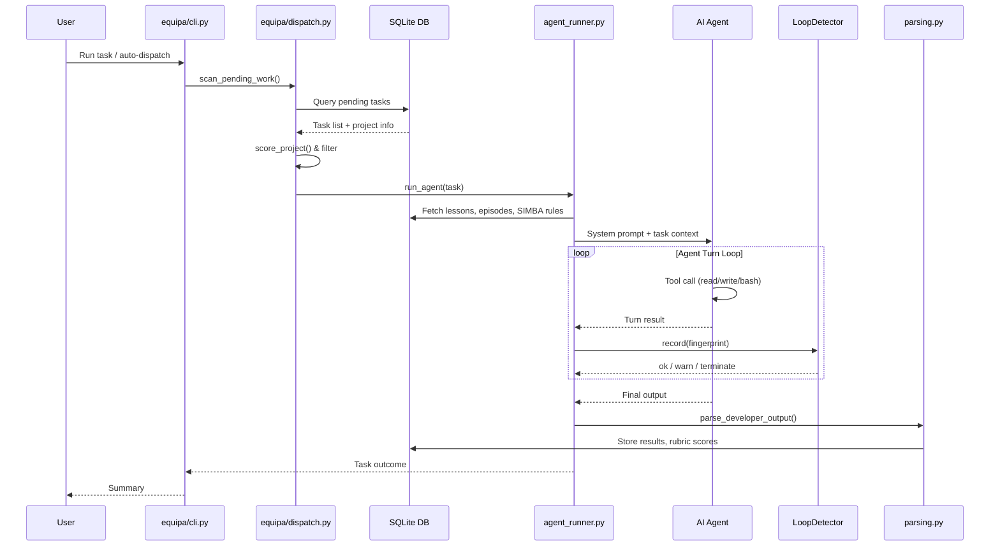
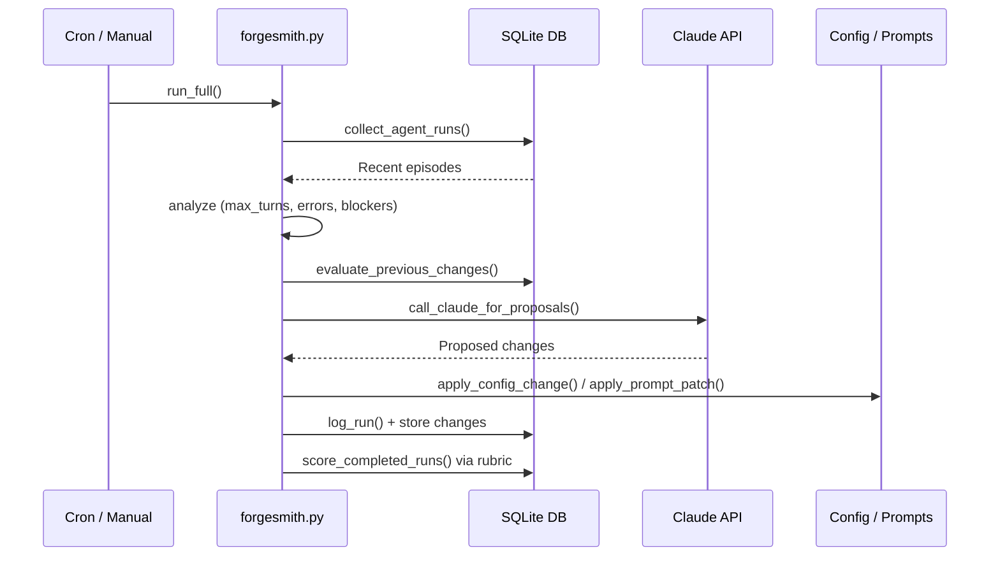
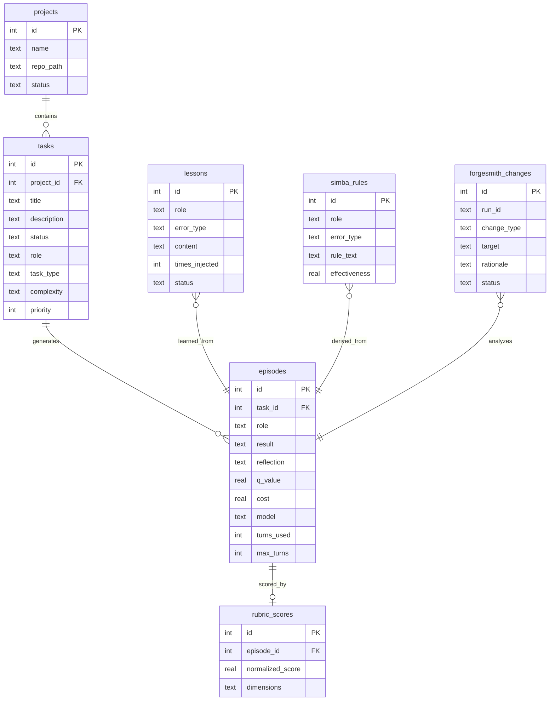

# ARCHITECTURE.md — EQUIPA

## Table of Contents

- [ARCHITECTURE.md — EQUIPA](#architecturemd-equipa)
  - [How It Works](#how-it-works)
  - [System Overview](#system-overview)
  - [Data Flow](#data-flow)
    - [Task Dispatch and Execution](#task-dispatch-and-execution)
    - [Forgesmith Self-Improvement Cycle](#forgesmith-self-improvement-cycle)
  - [Database](#database)
  - [Project Structure](#project-structure)
  - [Key Design Decisions](#key-design-decisions)
    - [Zero Dependencies](#zero-dependencies)
    - [SQLite as the Single Source of Truth](#sqlite-as-the-single-source-of-truth)
    - [Aggressive Early Termination](#aggressive-early-termination)
    - [Self-Improving Prompt Pipeline](#self-improving-prompt-pipeline)
    - [Lesson Sanitization as a Security Boundary](#lesson-sanitization-as-a-security-boundary)
    - [Provider Flexibility](#provider-flexibility)
    - [Schema Migrations with Backups](#schema-migrations-with-backups)
  - [Related Documentation](#related-documentation)

## How It Works

EQUIPA is a multi-agent AI orchestration platform that coordinates specialized AI agents (developer, tester, security reviewer, etc.) to complete coding tasks. Everything runs on pure Python with no external dependencies, backed by a SQLite database with 30+ tables.

**Here's what happens when you use EQUIPA:**

1. **You describe what you want** — in plain English, via the CLI or by creating a task in the database.

2. **The dispatcher scans for pending work** — `equipa/dispatch.py` queries the database for tasks that need doing, scores projects by priority, and decides which tasks to tackle next. It supports auto-dispatch (pick the highest-priority work), explicit task IDs, or goal-based parallel execution.

3. **A task gets routed to a specialized agent** — based on the task type and role (developer, tester, security reviewer), EQUIPA loads the right system prompt from the `prompts/` directory. It also detects the project's programming language and injects language-specific guidance. Before dispatch, a preflight check verifies the project builds.

4. **The agent runs in a monitored loop** — `equipa/agent_runner.py` launches the agent (Claude or a local Ollama model). Each turn, the agent can read files, write files, run bash commands, search code, and more. The `LoopDetector` in `equipa/monitoring.py` watches for stuck patterns — repeated outputs, monologuing without tool use, alternating error loops, and cost overruns. If the agent gets stuck, EQUIPA terminates it early.

5. **Lessons and episodes get injected** — before each run, EQUIPA pulls relevant past experiences from the database: lessons learned from previous failures (`equipa/lessons.py`), episode memory with Q-values, and SIMBA rules (situation-specific behavioral rules). These are sanitized (`lesson_sanitizer.py`) to prevent prompt injection, then woven into the system prompt.

6. **Results get parsed and evaluated** — `equipa/parsing.py` extracts structured output (reflections, approach summaries, test results) from agent responses. A rubric quality scorer (`rubric_quality_scorer.py`) grades the output across dimensions like code structure, naming, test coverage, documentation, and error handling.

7. **Forgesmith continuously improves the system** — this is the self-improvement engine. `forgesmith.py` analyzes past agent runs, identifies patterns (repeated errors, max-turns hits, underutilized budgets), and proposes configuration changes. Sub-modules handle specific optimization strategies:
   - **GEPA** (`forgesmith_gepa.py`) — evolves agent prompts using DSPy-style optimization
   - **SIMBA** (`forgesmith_simba.py`) — generates situation-specific behavioral rules from success/failure patterns
   - **Impact analysis** (`forgesmith_impact.py`) — assesses blast radius before applying changes
   - **Backfill** (`forgesmith_backfill.py`) — retroactively enriches historical run data

8. **Nightly review** provides a portfolio-level summary — `nightly_review.py` generates a report of accomplishments, blockers, stale projects, agent statistics, and upcoming reminders.

---

## System Overview



---

## Data Flow

### Task Dispatch and Execution



### Forgesmith Self-Improvement Cycle



---

## Database



---

## Project Structure

```
equipa/
├── equipa/                    # Core library package
│   ├── cli.py                 # Entry point — arg parsing, provider selection, main loop
│   ├── dispatch.py            # Task scoring, filtering, auto/parallel dispatch, goals
│   ├── agent_runner.py        # Launches agents, manages turn loop with timeout
│   ├── monitoring.py          # LoopDetector — stuck detection, budget warnings, cost breaker
│   ├── tasks.py               # Task fetching, complexity resolution, project dir lookup
│   ├── lessons.py             # Lesson/episode/SIMBA retrieval and injection counting
│   ├── parsing.py             # Output parsing, reflection extraction, Q-value computation
│   ├── prompts.py             # Checkpoint context builder for agent prompts
│   ├── preflight.py           # Pre-dispatch dependency installation
│   ├── messages.py            # Inter-agent message formatting
│   ├── manager.py             # Planner/evaluator output parsing
│   ├── output.py              # Terminal output formatting and summaries
│   ├── security.py            # Skill manifest integrity, untrusted content wrapping
│   ├── checkpoints.py         # Checkpoint file management
│   ├── db.py                  # DB connection, schema bootstrapping, error classification
│   └── git_ops.py             # Language detection, repo setup, gh CLI integration
├── forgesmith.py              # Main self-improvement engine — analysis, proposals, rollbacks
├── forgesmith_gepa.py         # Genetic/Evolutionary Prompt Adaptation (DSPy-based)
├── forgesmith_simba.py        # Situation-specific behavioral rule generation
├── forgesmith_impact.py       # Blast radius assessment for proposed changes
├── forgesmith_backfill.py     # Retroactive enrichment of historical episode data
├── ollama_agent.py            # Local Ollama model agent with sandboxed tool execution
├── rubric_quality_scorer.py   # Multi-dimension output quality scoring
├── lesson_sanitizer.py        # Injection-safe lesson content sanitization
├── nightly_review.py          # Portfolio-level daily status report
├── autoresearch_loop.py       # Automated prompt optimization via test-deploy-measure cycles
├── autoresearch_prompts.py    # OPRO-style prompt optimization with rollback support
├── analyze_performance.py     # Historical performance report builder
├── db_migrate.py              # Schema migration engine (v0→v4 with backups)
├── equipa_setup.py            # Interactive setup wizard for new installations
├── prompts/                   # Agent system prompts (per-role and per-language)
├── skills/                    # Skill modules (e.g., SARIF parsing for security analysis)
├── tools/                     # Utility scripts
│   ├── forge_dashboard.py     # Terminal dashboard for task/project metrics
│   ├── forge_arena.py         # Adversarial testing framework for agents
│   ├── prepare_training_data.py  # Fine-tuning data preparation
│   ├── ingest_training_results.py # Import training results into DB
│   └── benchmark_migrations.py    # Migration correctness and performance testing
└── tests/                     # Comprehensive test suite
    ├── test_early_termination.py  # Loop detection, monologue, budget, preflight tests
    ├── test_forgesmith_simba.py   # SIMBA rule generation and evaluation tests
    ├── test_lesson_sanitizer.py   # Injection prevention tests
    ├── test_agent_messages.py     # Inter-agent communication tests
    └── ...                        # ~15 test modules covering all subsystems
```

---

## Key Design Decisions

### Zero Dependencies
The entire core runs on Python's standard library. No pip install, no virtual environments, no version conflicts. SQLite provides the database. This makes deployment trivial — copy the files and run.

### SQLite as the Single Source of Truth
A single SQLite database (30+ tables) holds everything: tasks, episodes, lessons, SIMBA rules, forgesmith changes, rubric scores, and schema versions. This eliminates the need for external services and makes the entire system state inspectable with a single `sqlite3` command.

### Aggressive Early Termination
Rather than letting agents burn tokens when stuck, the `LoopDetector` implements multiple detection strategies: fingerprint-based repetition detection, monologue detection (text without tool use), alternating error pattern detection, cost breakers, and stuck-phrase matching. This saves significant API costs.

### Self-Improving Prompt Pipeline
Forgesmith is a closed-loop optimization system. It collects agent performance data, identifies failure patterns, proposes changes (config tweaks, prompt patches, SIMBA rules), applies them with impact assessment, and evaluates whether changes helped — rolling back if they didn't. GEPA adds DSPy-style evolutionary prompt optimization on top.

### Lesson Sanitization as a Security Boundary
Since lessons from past runs are injected into future agent prompts, `lesson_sanitizer.py` strips XML injection tags, role override phrases, base64 payloads, ANSI escapes, dangerous code blocks, and caps length. This prevents a compromised or adversarial agent output from poisoning future runs.

### Provider Flexibility
Agents can be backed by Claude (via API) or local Ollama models. The `ollama_agent.py` provides a full sandboxed tool execution environment with path safety checks and command blocking, enabling local-only operation.

### Schema Migrations with Backups
`db_migrate.py` implements versioned migrations (v0→v4) with automatic backup before each migration. The benchmark tool (`benchmark_migrations.py`) verifies migration correctness by creating test databases at each version and validating round-trip integrity.
---

## Related Documentation

- [Api](API.md)
- [Deployment](DEPLOYMENT.md)
- [Contributing](CONTRIBUTING.md)
