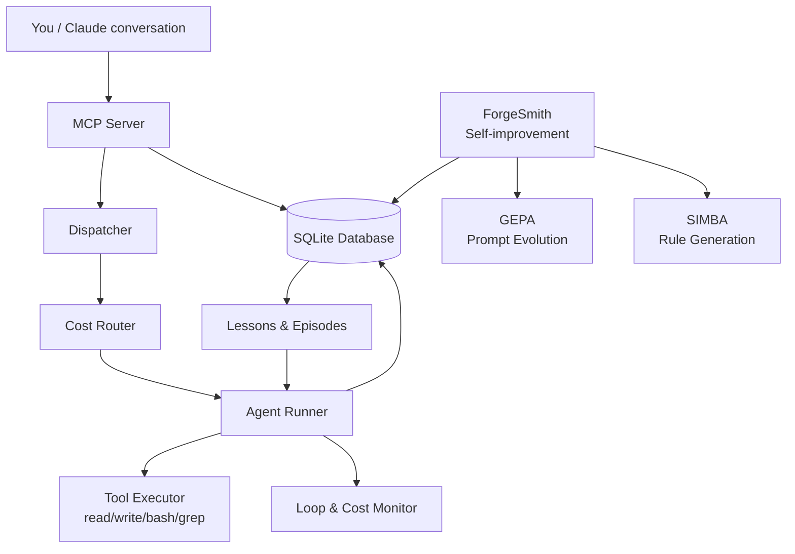
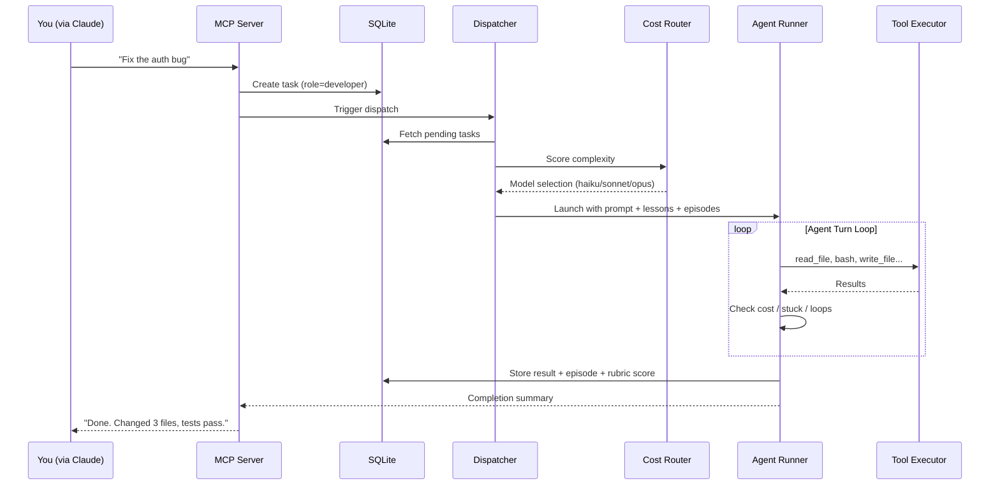
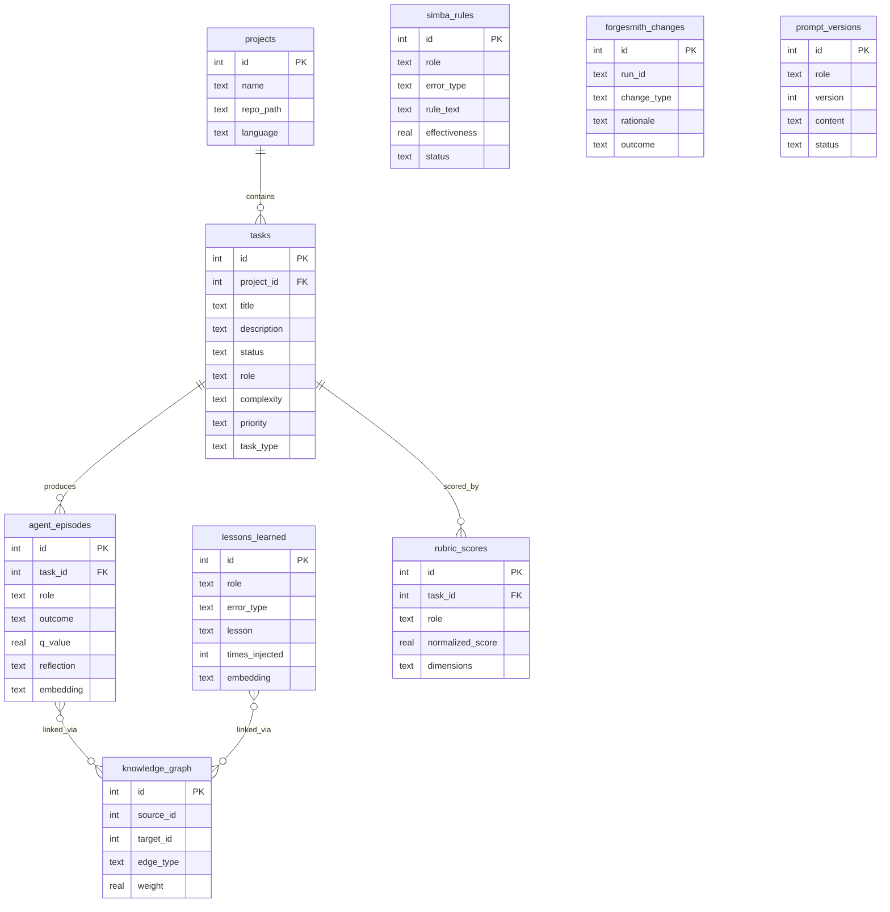

# ARCHITECTURE.md

## Table of Contents

- [ARCHITECTURE.md](#architecturemd)
  - [How It Works](#how-it-works)
  - [System Overview](#system-overview)
  - [Data Flow](#data-flow)
  - [Database](#database)
  - [Project Structure](#project-structure)
  - [Key Design Decisions](#key-design-decisions)
    - [Conversational-first, CLI-second](#conversational-first-cli-second)
    - [Zero dependencies](#zero-dependencies)
    - [SQLite as the single source of truth](#sqlite-as-the-single-source-of-truth)
    - [Cost-aware model routing](#cost-aware-model-routing)
    - [Aggressive early termination](#aggressive-early-termination)
    - [Anti-compaction state persistence](#anti-compaction-state-persistence)
    - [Self-improvement is a closed loop](#self-improvement-is-a-closed-loop)
    - [Lessons and episodes get sanitized](#lessons-and-episodes-get-sanitized)
    - [Nine specialized roles](#nine-specialized-roles)
  - [Current Limitations](#current-limitations)
  - [Related Documentation](#related-documentation)

## How It Works

You talk to Claude. That's the main interface.

You say something like "add pagination to the users endpoint" or "fix that failing test in the auth module." Claude figures out what needs to happen, creates tasks in EQUIPA's SQLite database, dispatches AI agents to do the work, monitors their progress, and reports back when they're done (or stuck).

Here's what happens under the hood:

1. **Claude receives your request** and breaks it into tasks. Each task gets a role (developer, tester, security reviewer, etc.), a complexity score, and a priority.

2. **The dispatcher picks up tasks** from the database. It scores each one, picks the right AI model based on complexity (cheap model for simple stuff, expensive model for hard stuff), and launches agents in parallel when possible.

3. **Each agent gets a specialized prompt** for its role, injected with lessons learned from past runs, episodic memories of similar tasks, and SIMBA rules (behavioral guardrails discovered by analyzing failure patterns). The agent also gets language-specific prompts — if your project is TypeScript, it gets TypeScript-flavored instructions.

4. **The agent works in a loop** — reading files, writing code, running tests, checking results. It has tools for file operations, bash commands, grep, and search. Each turn is monitored for cost, stuck behavior, monologuing, and tool loops. If the agent starts spinning its wheels, it gets killed early.

5. **When an agent finishes**, its output gets parsed, scored against a rubric, and stored as an episodic memory. If tests fail, the dev-test loop kicks in — the tester agent runs, reports failures, and the developer agent gets another shot with that context. This continues until tests pass or the budget runs out.

6. **ForgeSmith runs periodically** (usually on a cron) and reviews how agents performed. It extracts lessons from failures, adjusts configuration, evolves prompts, and generates SIMBA rules. Over time — we're talking 20-30 tasks minimum — the system actually gets better at your specific codebase.

7. **Claude reports results back to you.** Files changed, tests passing, any issues that need your attention.

The CLI (`equipa/cli.py`) exists and works, but most users never touch it. It's there for scripting and automation. The primary experience is conversational.

---

## System Overview



---

## Data Flow

A typical task dispatch — from your request to code changes:



---

## Database

EQUIPA uses a single SQLite file with 30+ tables. Here are the most important ones:



Schema migrations are handled by `db_migrate.py` — currently at v5. Each migration is versioned, logged, and creates a backup before running.

---

## Project Structure

```
equipa/                     # Core package
├── cli.py                  # CLI entry point, arg parsing, main loop
├── dispatch.py             # Task scoring, parallel dispatch, goal-based dispatch
├── routing.py              # Complexity scoring, model selection, circuit breaker
├── agent_runner.py         # Async subprocess runner for agent processes
├── tasks.py                # Task CRUD, project context resolution
├── prompts.py              # Checkpoint context building
├── parsing.py              # Output parsing, reflection extraction, Q-values
├── lessons.py              # Lesson retrieval, SIMBA rule injection, episode injection
├── monitoring.py           # Loop detection, budget tracking
├── mcp_server.py           # MCP protocol server (JSON-RPC over stdio)
├── mcp_health.py           # Health monitoring for MCP connections
├── messages.py             # Inter-agent messaging
├── manager.py              # Planner/evaluator output parsing
├── checkpoints.py          # Anti-compaction state persistence
├── preflight.py            # Pre-task dependency checks (npm install, etc.)
├── security.py             # Input sanitization, skill manifest integrity
├── embeddings.py           # Vector similarity, Ollama embedding integration
├── graph.py                # Knowledge graph (PageRank, label propagation)
├── hooks.py                # Event system for extensibility
├── git_ops.py              # Language detection, repo setup
├── db.py                   # SQLite connection, schema bootstrap, error classification
├── output.py               # Logging, dispatch summaries

forgesmith.py               # Self-improvement engine (main)
scripts/forgesmith_simba.py         # SIMBA: behavioral rule generation from failure patterns
forgesmith_gepa.py          # GEPA: genetic prompt evolution with A/B testing
scripts/forgesmith_impact.py        # Blast radius analysis for config changes
scripts/forgesmith_backfill.py      # Backfill episode data from agent logs

ollama_agent.py             # Local model agent with sandboxed tool execution
rubric_quality_scorer.py    # Multi-dimensional output scoring
lesson_sanitizer.py         # Injection-safe lesson formatting
scripts/nightly_review.py           # Portfolio status report generator
db_migrate.py               # Schema migrations (v0 → v5)
equipa_setup.py             # Interactive installer

skills/                     # Role-specific skill files and language prompts
├── security/               # SARIF parsing, static analysis helpers
tests/                      # 334+ tests
tools/                      # Dashboard, arena, benchmarks, training data prep
```

---

## Key Design Decisions

### Conversational-first, CLI-second
The MCP server (`mcp_server.py`) is the primary interface. Claude talks to EQUIPA over JSON-RPC on stdio. The CLI exists for scripting and debugging, but the design assumes most users never type an EQUIPA command directly.

### Zero dependencies
Everything is Python stdlib. No pip install, no virtualenv, no dependency hell. You copy the files and run them. This was a deliberate choice — it makes deployment trivial and eliminates a whole category of "it works on my machine" problems. The tradeoff is reimplementing some things (like HTTP clients for Ollama) that libraries would give you for free.

### SQLite as the single source of truth
One database file holds tasks, episodes, lessons, SIMBA rules, prompt versions, rubric scores, the knowledge graph — everything. No Redis, no Postgres, no message queue. This keeps things simple but means you can't run multiple dispatchers against the same DB without care.

### Cost-aware model routing
Not every task needs the most expensive model. The router scores task complexity across four dimensions (lexical, semantic, scope, uncertainty) and picks haiku for trivial stuff, sonnet for medium work, opus for the hard problems. A circuit breaker degrades to cheaper models if the expensive ones keep failing. This actually saves real money.

### Aggressive early termination
Agents get killed if they: monologue for 3+ turns without using tools, repeat the same tool calls in a loop, hit cost limits (scaled by complexity), or match "stuck phrases" like "I need to think about this more." The thresholds are tuned — and honestly, sometimes they're too aggressive for legitimately complex tasks that need more exploration time.

### Anti-compaction state persistence
Checkpoints are written so that if Claude's context window compacts mid-task, the agent can resume with full state. This matters for long-running tasks that exceed the context limit.

### Self-improvement is a closed loop
ForgeSmith analyzes completed runs → extracts lessons and failure patterns → SIMBA generates behavioral rules → GEPA evolves role prompts using genetic algorithms + A/B testing → changes get evaluated on subsequent runs → ineffective changes get rolled back. It's a real feedback loop, but it's slow. You need 20-30 completed tasks before the system has enough signal to improve meaningfully.

### Lessons and episodes get sanitized
Since lessons learned from one run get injected into future agent prompts, there's a real injection risk. The `lesson_sanitizer.py` strips XML tags, base64 payloads, ANSI escapes, role override phrases, and dangerous code blocks before anything gets injected. This is a defense-in-depth thing — the agents shouldn't be able to poison their own future prompts.

### Nine specialized roles
Developer, tester, security reviewer, planner, evaluator, and others. Each gets a different system prompt tuned to its job, with language-specific addons (Python prompt, TypeScript prompt, Go prompt, etc.). The prompts contain few-shot examples of both successful and failed runs — showing agents what "done" looks like and what "stuck" looks like.

---

## Current Limitations

**Agents still get stuck on complex tasks.** Analysis paralysis is real — an agent will sometimes read the same files over and over, planning its approach without ever writing code. The early termination catches this eventually, but it wastes turns.

**Git worktree merges occasionally need manual intervention.** When agents work in parallel on separate worktrees, the merge back can conflict. This usually works fine, but "usually" isn't "always."

**Self-improvement needs volume.** ForgeSmith, GEPA, and SIMBA need 20-30 completed tasks before patterns emerge. On a new project, you're running on the default prompts for a while.

**The tester role depends on your project having tests.** If your project doesn't have a working test suite with a discoverable test runner, the dev-test loop doesn't work. The tester agent can't verify what it can't run.

**Early termination is sometimes too aggressive.** The 10-turn reading limit catches stuck agents, but some legitimately complex tasks — like understanding a large codebase before making a cross-cutting change — need more exploration time. There's tension between "stop wasting money" and "let the agent think."

**Single SQLite file.** Works great for one user or one team. Won't work if you need concurrent dispatchers or distributed agents. That's a fundamental constraint of the architecture, not a bug.

**Vector memory needs Ollama running locally.** The embedding features (vector similarity for episodes and lessons, knowledge graph) require a local Ollama instance. Without it, the system falls back to keyword matching, which works but isn't as good.
---

## Related Documentation

- [Readme](README.md)
- [Api](API.md)
- [Deployment](DEPLOYMENT.md)
- [Contributing](CONTRIBUTING.md)
