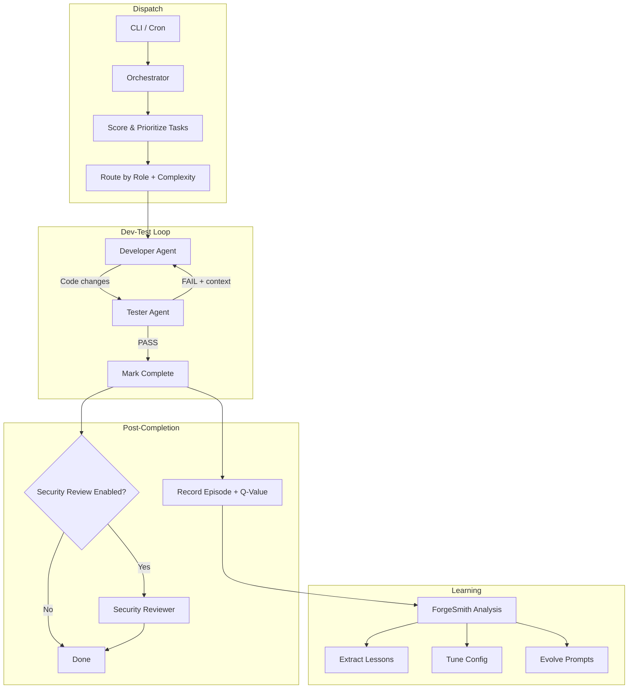
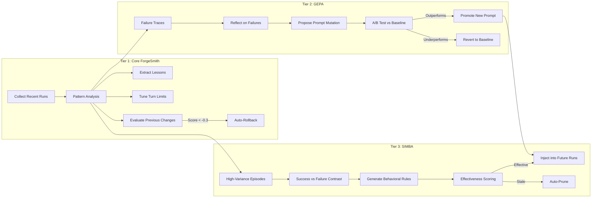

# Project Pombal: Multi-Agent AI Orchestration Platform

Project Pombal is a self-improving, multi-agent orchestration platform that you control through natural conversation. Tell Claude what you want done -- it handles task management, agent dispatch, progress tracking, and reporting. You make decisions; the system handles execution.

Built in pure Python stdlib on SQLite. Zero pip dependencies. Runs anywhere Python and Claude Code are installed.

---

## Table of Contents

- [Conversational Development](#conversational-development)
- [Multi-Agent Orchestration](#multi-agent-orchestration)
- [ForgeSmith Self-Improvement Engine](#forgesmith-self-improvement-engine)
- [Security Pipeline](#security-pipeline)
- [Database Migration System](#database-migration-system)
- [Inter-Agent Communication](#inter-agent-communication)
- [Observability and Cost Tracking](#observability-and-cost-tracking)
- [Extensibility](#extensibility)
- [Technical Highlights](#technical-highlights)

---

## Conversational Development

The primary interface to Project Pombal is **natural language conversation with Claude**. Claude has MCP access to the full project database and knows how to use every tool in the system. You never need to memorize CLI commands, look up task IDs, or write SQL.

### What it looks like in practice

| You say | What happens behind the scenes |
|---------|-------------------------------|
| "What's the status of our Loom project?" | Claude queries project dashboard, recent sessions, open tasks, and blockers |
| "What tasks are outstanding?" | Claude pulls all pending/in-progress tasks, groups by project and priority |
| "Work on the next high-priority Loom task" | Claude finds the task, loads project context, dispatches developer + tester agents, reports results |
| "Add a task for Loom: implement dark mode" | Claude creates the task with correct project ID and priority |
| "Run a security review on what we just shipped" | Claude dispatches security-reviewer with Trail of Bits tooling |
| "How much have we spent this month?" | Claude queries cost tracking views, breaks down by project and role |
| "What did we decide about the auth approach?" | Claude searches the decisions table and returns the rationale |
| "Update TheForge with what we did today" | Claude logs session notes, updates task statuses, records decisions |

### You make decisions. Claude manages everything else.

The entire project management layer -- task creation, prioritization, context loading, agent dispatch, progress tracking, session logging, and reporting -- is handled conversationally. You stay focused on **what** to build. The system handles **how** to coordinate the work.

### The CLI still exists

Everything above can also be done from the command line for automation (cron jobs, CI/CD, scripted workflows). But for day-to-day work, you never touch it. See [CLI Reference](#cli-reference) in the README.

---

## Multi-Agent Orchestration

Under the hood, Project Pombal dispatches work to **9 specialized agent roles**, each with tailored system prompts, turn budgets, model assignments, and injected context from past experience.

| Role | Purpose | Default Model | Turn Budget |
|------|---------|---------------|-------------|
| **Developer** | Writes code, implements features, fixes bugs | Opus | 45 |
| **Tester** | Validates code, writes tests, verifies fixes | Sonnet | 75 |
| **Planner** | Breaks goals into prioritized, dependency-aware tasks | Opus | 20 |
| **Evaluator** | Scores agent output against rubrics | Sonnet | 25 |
| **Security Reviewer** | Deep security audit with Trail of Bits tooling | Opus | 50 |
| **Frontend Designer** | UI/UX implementation and design review | Opus | 40 |
| **Integration Tester** | Cross-component and API testing | Sonnet | 20 |
| **Debugger** | Root-cause analysis and targeted fixes | Opus | 30 |
| **Code Reviewer** | Quality, style, and architecture review | Sonnet | 75 |

### Dev-Test Cycle

The core execution loop pairs a Developer agent with a Tester agent. The developer writes code; the tester validates it. They iterate until tests pass or the turn budget is exhausted. Failed test output feeds directly into the developer's next attempt with full context.

### Goal-Driven Autonomous Mode

Tell Claude your goal in plain English and it decomposes the work into concrete tasks, prioritizes them by dependency and complexity, and dispatches agents automatically.

> "Add JWT authentication to the API" --> Planner creates 5 tasks --> Developer + Tester work through each one --> Security reviewer audits the result

### Auto-Run Scanning

Auto-run mode scans all registered projects for pending tasks, scores them by priority, and dispatches work across projects in parallel -- up to 4 concurrent agents by default.



---

## ForgeSmith Self-Improvement Engine

ForgeSmith is a three-tier learning system that analyzes completed agent runs and evolves the platform's behavior over time. It operates on different granularities and timescales, from quick config adjustments to full prompt rewrites.

### Tier 1: Core ForgeSmith

Rule-based analysis of recent agent runs. Detects patterns and makes targeted adjustments.

- **Lesson extraction** -- Identifies repeated failures and generates lessons injected into future prompts
- **Turn limit tuning** -- Detects turn overuse and underuse; adjusts budgets per role
- **Model assignment** -- Routes complex tasks to stronger models, simple tasks to faster ones
- **Config patching** -- Adjusts thresholds, concurrency limits, and dispatch weights
- **Effectiveness scoring** -- Scores all changes before/after. Changes below the rollback threshold (-0.3) are automatically reverted

### Tier 2: GEPA Prompt Evolution

Generalized Efficient Prompt Adaptation. Uses DSPy-style optimization to evolve entire system prompts.

- **Evolutionary rewriting** -- Reflects on failure traces and proposes prompt mutations
- **A/B testing** -- Evolved prompts run in 50/50 split against baselines. Underperformers rolled back after 10+ tasks
- **Safety rails** -- Maximum 20% prompt change per cycle. Protected sections cannot be modified
- **Rollback** -- Automatic reversion if evolved prompts underperform the baseline

### Tier 3: SIMBA Rule Synthesis

Systematic Identification of Mistakes and Behavioral Adjustments. Targets the hardest cases.

- **Contrastive analysis** -- Compares successful vs. failed episodes for the same task type
- **Rule generation** -- Uses Claude to synthesize specific behavioral rules from failure patterns
- **Effectiveness tracking** -- Each rule carries an effectiveness score; stale or ineffective rules are auto-pruned
- **Signature deduplication** -- Prevents redundant rules from accumulating



### Episodic Memory with Q-Values

Every agent run is recorded as an episode with a reinforcement learning Q-value. High-Q episodes are preferentially injected into future runs. Q-values update based on outcomes: +0.1 on success, -0.05 on failure. This creates a reinforcement learning loop without explicit training infrastructure.

---

## Security Pipeline

Project Pombal's security review capability is not a checkbox -- it is a full-depth analysis pipeline built on Trail of Bits security skills.

### 7 Security Skills

| Skill | What It Does |
|-------|-------------|
| **Static Analysis** | Semgrep + CodeQL automated vulnerability scanning |
| **Audit Context Building** | Deep architectural analysis -- trust boundaries, data flows, external inputs |
| **Variant Analysis** | Finds similar vulnerabilities across the entire codebase |
| **Differential Review** | Security-focused review of code changes (diffs) |
| **Fix Review** | Validates that security fixes are correct and complete |
| **Semgrep Rule Creator** | Generates custom detection rules for recurring vulnerability patterns |
| **Sharp Edges** | Identifies dangerous APIs and footgun designs |

### How It Works

1. **Context building** -- The security reviewer reads the target codebase, maps trust boundaries, and identifies data flows
2. **Automated scanning** -- Runs Bandit (Python), Semgrep, and CodeQL against the project
3. **Manual deep review** -- 10-category manual analysis covering the OWASP Top 10 and beyond: injection, auth/authz, secrets exposure, input validation, cryptography, error handling, dependency risks, file operations, network security, and business logic
4. **Findings logged** -- Each finding gets a severity rating (Critical/High/Medium/Low/Info) and is recorded in the database

### Configuration

The security reviewer runs with **Opus** and a **50-turn budget** -- the deepest analysis allocation of any role. It is **exempt from early termination**, meaning the loop detector will not cut a security review short. When `security_review: true` is set in dispatch config, security reviews auto-dispatch after every completed dev-test cycle.

---

## Database Migration System

`db_migrate.py` implements a linear migration chain (v0 through v3) with automatic version detection, backup, and audit logging. It is stdlib-only and has been benchmarked for correctness.

### Version Detection

Two-strategy version detection handles both new and legacy databases:

1. **PRAGMA user_version** -- The standard SQLite version marker, set by migrations and `schema.sql`
2. **Table fingerprinting** -- For databases that predate the migration system, detects version by which tables exist (e.g., `agent_messages` + `agent_actions` = v3, `lessons_learned` + `rubric_scores` = v2)

### Migration Guarantees

- **Timestamped backup** before any schema change
- **Sequential migration application** -- Each step is atomic; partial failures leave the DB in a known state
- **Audit logging** -- Every migration step recorded in `schema_migrations` with from/to version and timestamp
- **Idempotent operations** -- `CREATE TABLE IF NOT EXISTS`, `CREATE INDEX IF NOT EXISTS`, duplicate-column-safe `ALTER TABLE`

### Benchmark Results

Reproducible benchmarks via `benchmark_migrations.py`. The benchmark creates realistic databases at each schema version with populated data, runs the full migration chain, and verifies zero data loss.

| Upgrade Path | Time | Data Preserved | Status |
|-------------|------|----------------|--------|
| **v1 -> v3** | 103ms | 88 rows across all tables | PASS |
| **v2 -> v3** | 37ms | 207 rows across all tables | PASS |
| **v3 -> v3 (no-op)** | < 1ms | All data untouched | PASS |
| **Fresh install** | < 1ms | N/A | PASS |

**Verification suite:**
- Per-table row counts verified before and after migration
- Spot checks on specific row content (project names, task titles, decision text)
- Backup file integrity verification (valid SQLite, row counts match pre-migration)
- New tables confirmed empty (no phantom data)
- PRAGMA user_version set correctly after each step
- Audit log entries validated for every migration step

---

## Inter-Agent Communication

Added in v3.0, the inter-agent messaging system enables structured communication between agents across dev-test cycles.

### Structured Message Passing

Agents post typed messages to each other via the `agent_messages` table. The tester posts test results (pass/fail/blocked) as structured messages. The developer reads unread messages at the start of each cycle. Messages are scoped by task and cycle, with read-tracking so agents never process the same message twice.

```sql
-- Tester posts results for the developer
INSERT INTO agent_messages (task_id, cycle_number, from_role, to_role, message_type, content)
VALUES (42, 3, 'tester', 'developer', 'test_result', 'FAIL: 2 of 5 tests failing...');

-- Developer reads unread messages at cycle start
SELECT * FROM agent_messages WHERE task_id = 42 AND to_role = 'developer' AND read_by_cycle IS NULL;
```

### Per-Tool Action Logging

Every tool call during agent execution is logged to `agent_actions` with:

- **Input hashing** (SHA256) -- Enables dedup detection. If an agent calls the same tool with the same input twice, it is likely stuck
- **Error classification** -- Errors are categorized by type for ForgeSmith pattern analysis
- **Output length tracking** -- Detects abnormally large or empty outputs
- **Duration tracking** -- Per-action timing for performance profiling

### Error Classification and Dedup Detection

The orchestrator classifies errors into typed categories (compilation, test failure, timeout, permission, etc.) and tracks them per run. Combined with input hashing on agent actions, this surfaces repeated failing approaches and feeds the LoopDetector -- which uses deterministic fingerprinting of agent outputs to detect and terminate stuck loops.

---

## Observability and Cost Tracking

### Per-Run Cost Tracking

Every agent run records model used, turns consumed, wall-clock duration, and estimated cost in USD. This data feeds into two built-in views:

- **`v_cost_by_project`** -- Total runs, turns, duration, and cost broken down by project
- **`v_cost_by_role`** -- Same breakdown by agent role, including average cost per run

### ForgeSmith Analysis Pipeline

ForgeSmith runs are themselves logged with full metadata: number of runs analyzed, changes proposed, changes applied, and summary. Each change carries an effectiveness score computed from before/after comparison of agent performance.

### Episode Q-Values

The episodic memory system assigns Q-values to every agent episode. These values decay or improve based on real outcomes, creating a lightweight reinforcement learning signal without any training infrastructure. High-Q episodes are preferentially selected for injection into future agent prompts.

### Dashboard

`forge_dashboard.py` provides a terminal-based view of:

- Task completion rates by project and priority
- Blocked items and open questions
- Session activity over time
- Agent performance trends

---

## Extensibility

### Drop-In Custom Agents

Create a new agent role by dropping a Markdown file into the `prompts/` directory. The orchestrator auto-discovers it via `_discover_roles()`. No code changes required.

```
prompts/
  developer.md
  tester.md
  security-reviewer.md
  my-custom-role.md      <-- auto-discovered
```

### Configurable Permissions Per Role

`dispatch_config.json` controls per-role settings:

- Model assignment (Opus for complex work, Sonnet for review tasks)
- Turn budgets per role
- Provider selection per role (Claude API, local Ollama)
- Task-type-specific prompt guidance (bug fix, feature, refactor, test)

### MCP Server Integration

Project Pombal generates MCP configuration during setup, giving AI agents direct database access for querying task status, reading episodes, and updating results.

### Local LLM Support via Ollama

Read-only roles (planner, evaluator, code-reviewer, researcher) can run on local models via Ollama at zero API cost. The provider abstraction handles routing transparently -- configure once in `dispatch_config.json` and the orchestrator handles the rest.

```json
{
    "provider": "claude",
    "provider_planner": "ollama",
    "provider_evaluator": "ollama",
    "ollama_base_url": "http://localhost:11434",
    "ollama_model": "qwen3.5:27b"
}
```

---

## Technical Highlights

| Property | Detail |
|----------|--------|
| **Zero pip dependencies** | Core platform is stdlib-only Python. No `requirements.txt`. Requires Python 3.10+, Claude Code CLI, git, and uvx as runtime prerequisites |
| **SQLite-based** | Single-file database. Trivially portable, trivially backupable. No database server required |
| **Cross-platform** | Runs on Linux and Windows. Tested on Ubuntu 24.04 and Windows 10/11 |
| **CLI-first** | Every operation available from the command line. No web UI required (dashboard is terminal-based) |
| **Checkpoint resilience** | Long-running tasks save checkpoints. Interrupted work resumes from the last saved state |
| **Loop detection** | Deterministic fingerprinting of agent output detects stuck loops. File changes reset the counter -- progress is recognized |
| **Dynamic budgets** | Turn budgets adapt based on task complexity and intermediate results. Prevents both premature termination and runaway loops |
| **30-table schema** | Full relational model covering projects, tasks, episodes, lessons, messages, actions, rules, prompt versions, rubric scores, and migration history |
| **Reproducible benchmarks** | Migration benchmarks generate realistic test data, run the full chain, and verify zero data loss |
| **Arena mode** | Adversarial testing system that stress-tests agents and exports results as LoRA fine-tuning data |

---

<p align="center">
  <strong>Built by Forgeborn</strong><br>
  Vibe coded with Claude<br>
  <em>&copy; 2026 Forgeborn</em>
</p>
