# ProjectPombal - Architecture Diagrams

Generated by Athena v1.0.0 on 2026-03-13T02:25:20.994Z

**Framework:** unknown | **Language:** unknown

---

## Table of Contents

- [Database Schema](#database-schema)
- [File Structure](#file-structure)

## Database Schema

Entity-relationship diagram of the database schema (from Prisma, SQL, or ORM entities).

```mermaid
erDiagram
  projects {
    int id PK
    string name
    string codename
    string category
    string status
    string summary
    string target_market
    string revenue_model
    string created_at
    string updated_at
    string icon_base64
  }
  tasks {
    int id PK
    int project_id FK
    string title
    string description
    string status
    string priority
    string blocked_by
    datetime due_date
    string completed_at
    string created_at
  }
  decisions {
    int id PK
    int project_id FK
    string topic
    string decision
    string rationale
    string alternatives_considered
    string decided_at
  }
  open_questions {
    int id PK
    int project_id FK
    string question
    string context
    string priority
    int resolved
    string resolution
    string asked_at
    string resolved_at
  }
  session_notes {
    int id PK
    int project_id FK
    datetime session_date
    string summary
    string key_points
    string next_steps
    string chat_url
    string created_at
  }
  code_artifacts {
    int id PK
    int project_id FK
    string name
    string language
    string code
    string purpose
    string file_path
    string version
    string created_at
    string updated_at
  }
  components {
    int id PK
    int project_id FK
    string name
    string type
    string specs
    float price
    string currency
    string vendor
    string url
    string status
    string notes
    string added_at
  }
  competitors {
    int id PK
    int project_id FK
    string name
    string product_name
    string price_range
    string strengths
    string weaknesses
    string url
    string notes
    string analyzed_at
  }
  content_tickler {
    int id PK
    int project_id FK
    string platform
    int total_posts
    int posts_used
    int posts_remaining
    int alert_threshold
    datetime last_checked
    int needs_content
    string notes
    string created_at
    string updated_at
  }
  cross_references {
    int id PK
    string source_table
    int source_id
    string target_table
    int target_id
    string relationship
    string created_at
  }
  documents {
    int id PK
    int project_id FK
    string name
    string type
    string file_path
    string description
    string version
    string created_at
    string updated_at
  }
  posting_schedule {
    int id PK
    int project_id FK
    int week_number
    string day_of_week
    string platform
    string product
    string post_id
    datetime scheduled_date
    string status
    string created_at
  }
  product_opportunities {
    int id PK
    string industry
    string opportunity_name
    string target_market
    string pain_points
    string existing_solutions
    string pricing_landscape
    int opportunity_score
    string notes
    string status
    string researched_at
    string updated_at
  }
  project_assets {
    int id PK
    int project_id FK
    string asset_type
    string asset_name
    string description
    boolean is_primary
    string file_path
    string base64_data
    string created_at
  }
  build_info {
    int id PK
    int project_id FK
    string build_type
    string build_command
    string output_path
    string output_filename
    string prerequisites
    string notes
    datetime created_at
    datetime updated_at
  }
  tasks }o--|| projects : "project_id"
  decisions }o--|| projects : "project_id"
  open_questions }o--|| projects : "project_id"
  session_notes }o--|| projects : "project_id"
  code_artifacts }o--|| projects : "project_id"
  components }o--|| projects : "project_id"
  competitors }o--|| projects : "project_id"
  content_tickler }o--|| projects : "project_id"
  documents }o--|| projects : "project_id"
  posting_schedule }o--|| projects : "project_id"
  project_assets }o--|| projects : "project_id"
  build_info }o--|| projects : "project_id"
```

Mermaid source

---

## File Structure

Directory tree of important project files and folders.

```mermaid
graph TD
  srv_forge_share_AI_Stuff_ProjectPombal["ProjectPombal (67)"]:::dir
  srv_forge_share_AI_Stuff_ProjectPombal_docs["docs (14)"]:::dir
  srv_forge_share_AI_Stuff_ProjectPombal --> srv_forge_share_AI_Stuff_ProjectPombal_docs
  srv_forge_share_AI_Stuff_ProjectPombal_docs_diagrams["diagrams (3)"]:::dir
  srv_forge_share_AI_Stuff_ProjectPombal_docs --> srv_forge_share_AI_Stuff_ProjectPombal_docs_diagrams
  srv_forge_share_AI_Stuff_ProjectPombal_docs_diagrams_more["3 more files"]:::meta
  srv_forge_share_AI_Stuff_ProjectPombal_docs_diagrams --> srv_forge_share_AI_Stuff_ProjectPombal_docs_diagrams_more
  srv_forge_share_AI_Stuff_ProjectPombal_docs_README_md["README.md"]:::file
  srv_forge_share_AI_Stuff_ProjectPombal_docs --> srv_forge_share_AI_Stuff_ProjectPombal_docs_README_md
  srv_forge_share_AI_Stuff_ProjectPombal_docs_more["13 more files"]:::meta
  srv_forge_share_AI_Stuff_ProjectPombal_docs --> srv_forge_share_AI_Stuff_ProjectPombal_docs_more
  srv_forge_share_AI_Stuff_ProjectPombal_prompts["prompts (16)"]:::dir
  srv_forge_share_AI_Stuff_ProjectPombal --> srv_forge_share_AI_Stuff_ProjectPombal_prompts
  srv_forge_share_AI_Stuff_ProjectPombal_prompts_more["16 more files"]:::meta
  srv_forge_share_AI_Stuff_ProjectPombal_prompts --> srv_forge_share_AI_Stuff_ProjectPombal_prompts_more
  srv_forge_share_AI_Stuff_ProjectPombal_skills["skills"]:::dir
  srv_forge_share_AI_Stuff_ProjectPombal --> srv_forge_share_AI_Stuff_ProjectPombal_skills
  srv_forge_share_AI_Stuff_ProjectPombal_skills_code_reviewer["code-reviewer (1)"]:::dir
  srv_forge_share_AI_Stuff_ProjectPombal_skills --> srv_forge_share_AI_Stuff_ProjectPombal_skills_code_reviewer
  srv_forge_share_AI_Stuff_ProjectPombal_skills_code_reviewer_skills["skills"]:::dir
  srv_forge_share_AI_Stuff_ProjectPombal_skills_code_reviewer --> srv_forge_share_AI_Stuff_ProjectPombal_skills_code_reviewer_skills
  srv_forge_share_AI_Stuff_ProjectPombal_skills_code_reviewer_README_md["README.md"]:::file
  srv_forge_share_AI_Stuff_ProjectPombal_skills_code_reviewer --> srv_forge_share_AI_Stuff_ProjectPombal_skills_code_reviewer_README_md
  srv_forge_share_AI_Stuff_ProjectPombal_skills_debugger["debugger (1)"]:::dir
  srv_forge_share_AI_Stuff_ProjectPombal_skills --> srv_forge_share_AI_Stuff_ProjectPombal_skills_debugger
  srv_forge_share_AI_Stuff_ProjectPombal_skills_debugger_skills["skills"]:::dir
  srv_forge_share_AI_Stuff_ProjectPombal_skills_debugger --> srv_forge_share_AI_Stuff_ProjectPombal_skills_debugger_skills
  srv_forge_share_AI_Stuff_ProjectPombal_skills_debugger_README_md["README.md"]:::file
  srv_forge_share_AI_Stuff_ProjectPombal_skills_debugger --> srv_forge_share_AI_Stuff_ProjectPombal_skills_debugger_README_md
  srv_forge_share_AI_Stuff_ProjectPombal_skills_developer["developer (1)"]:::dir
  srv_forge_share_AI_Stuff_ProjectPombal_skills --> srv_forge_share_AI_Stuff_ProjectPombal_skills_developer
  srv_forge_share_AI_Stuff_ProjectPombal_skills_developer_skills["skills"]:::dir
  srv_forge_share_AI_Stuff_ProjectPombal_skills_developer --> srv_forge_share_AI_Stuff_ProjectPombal_skills_developer_skills
  srv_forge_share_AI_Stuff_ProjectPombal_skills_developer_README_md["README.md"]:::file
  srv_forge_share_AI_Stuff_ProjectPombal_skills_developer --> srv_forge_share_AI_Stuff_ProjectPombal_skills_developer_README_md
  srv_forge_share_AI_Stuff_ProjectPombal_skills_security["security"]:::dir
  srv_forge_share_AI_Stuff_ProjectPombal_skills --> srv_forge_share_AI_Stuff_ProjectPombal_skills_security
  srv_forge_share_AI_Stuff_ProjectPombal_skills_security_audit_context_building["audit-context-building"]:::dir
  srv_forge_share_AI_Stuff_ProjectPombal_skills_security --> srv_forge_share_AI_Stuff_ProjectPombal_skills_security_audit_context_building
  srv_forge_share_AI_Stuff_ProjectPombal_skills_security_differential_review["differential-review"]:::dir
  srv_forge_share_AI_Stuff_ProjectPombal_skills_security --> srv_forge_share_AI_Stuff_ProjectPombal_skills_security_differential_review
  srv_forge_share_AI_Stuff_ProjectPombal_skills_security_fix_review["fix-review"]:::dir
  srv_forge_share_AI_Stuff_ProjectPombal_skills_security --> srv_forge_share_AI_Stuff_ProjectPombal_skills_security_fix_review
  srv_forge_share_AI_Stuff_ProjectPombal_skills_security_semgrep_rule_creator["semgrep-rule-creator"]:::dir
  srv_forge_share_AI_Stuff_ProjectPombal_skills_security --> srv_forge_share_AI_Stuff_ProjectPombal_skills_security_semgrep_rule_creator
  srv_forge_share_AI_Stuff_ProjectPombal_skills_security_sharp_edges["sharp-edges"]:::dir
  srv_forge_share_AI_Stuff_ProjectPombal_skills_security --> srv_forge_share_AI_Stuff_ProjectPombal_skills_security_sharp_edges
  srv_forge_share_AI_Stuff_ProjectPombal_skills_security_static_analysis["static-analysis"]:::dir
  srv_forge_share_AI_Stuff_ProjectPombal_skills_security --> srv_forge_share_AI_Stuff_ProjectPombal_skills_security_static_analysis
  srv_forge_share_AI_Stuff_ProjectPombal_skills_security_variant_analysis["variant-analysis"]:::dir
  srv_forge_share_AI_Stuff_ProjectPombal_skills_security --> srv_forge_share_AI_Stuff_ProjectPombal_skills_security_variant_analysis
  srv_forge_share_AI_Stuff_ProjectPombal_skills_tester["tester (1)"]:::dir
  srv_forge_share_AI_Stuff_ProjectPombal_skills --> srv_forge_share_AI_Stuff_ProjectPombal_skills_tester
  srv_forge_share_AI_Stuff_ProjectPombal_skills_tester_skills["skills"]:::dir
  srv_forge_share_AI_Stuff_ProjectPombal_skills_tester --> srv_forge_share_AI_Stuff_ProjectPombal_skills_tester_skills
  srv_forge_share_AI_Stuff_ProjectPombal_skills_tester_README_md["README.md"]:::file
  srv_forge_share_AI_Stuff_ProjectPombal_skills_tester --> srv_forge_share_AI_Stuff_ProjectPombal_skills_tester_README_md
  srv_forge_share_AI_Stuff_ProjectPombal_CLAUDE_md["CLAUDE.md"]:::file
  srv_forge_share_AI_Stuff_ProjectPombal --> srv_forge_share_AI_Stuff_ProjectPombal_CLAUDE_md
  srv_forge_share_AI_Stuff_ProjectPombal_README_md["README.md"]:::file
  srv_forge_share_AI_Stuff_ProjectPombal --> srv_forge_share_AI_Stuff_ProjectPombal_README_md
  srv_forge_share_AI_Stuff_ProjectPombal_more["65 more files"]:::meta
  srv_forge_share_AI_Stuff_ProjectPombal --> srv_forge_share_AI_Stuff_ProjectPombal_more
  classDef dir fill:#e8f4f8,stroke:#2196F3,stroke-width:2px
  classDef file fill:#fff,stroke:#666
  classDef meta fill:#f5f5f5,stroke:#999,stroke-dasharray: 5 5
```

Mermaid source

---
